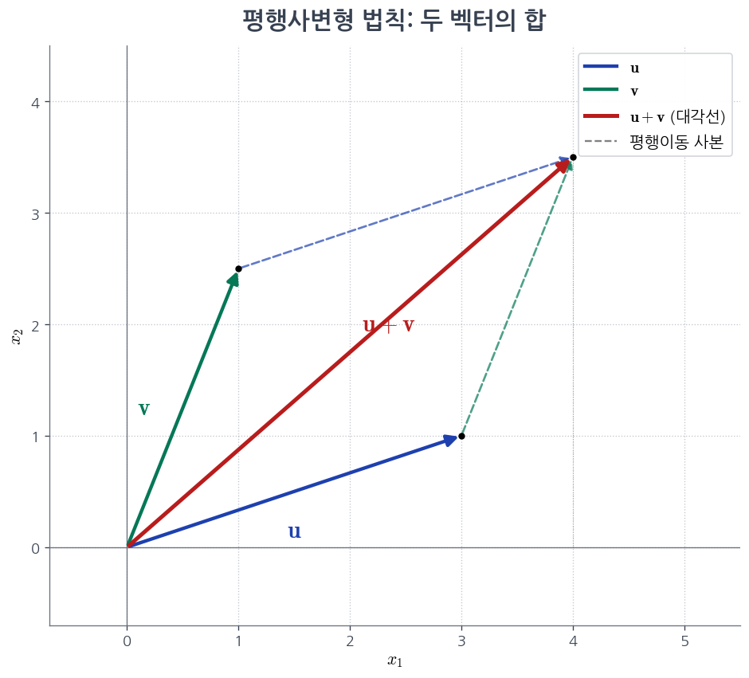
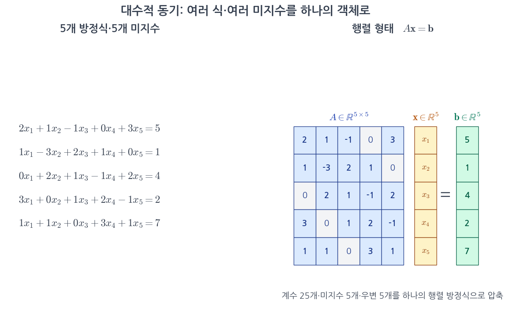
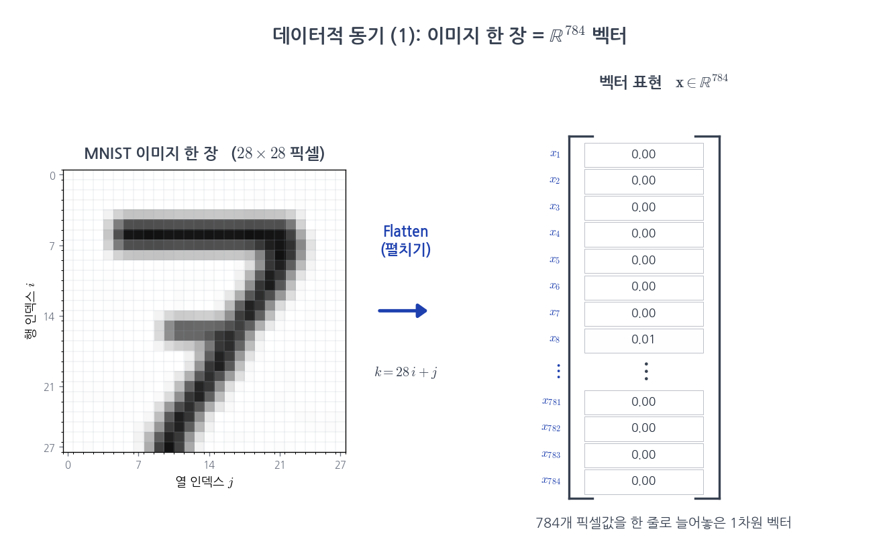
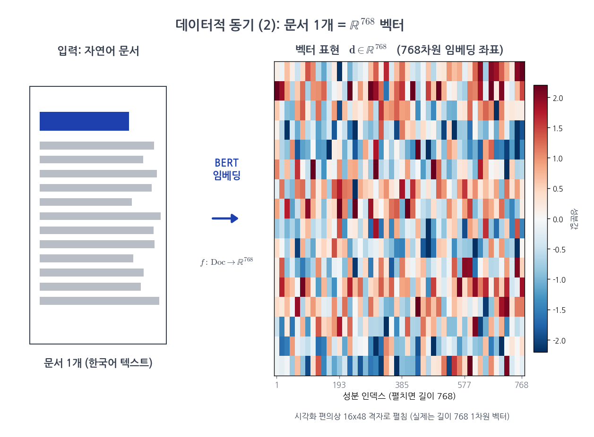
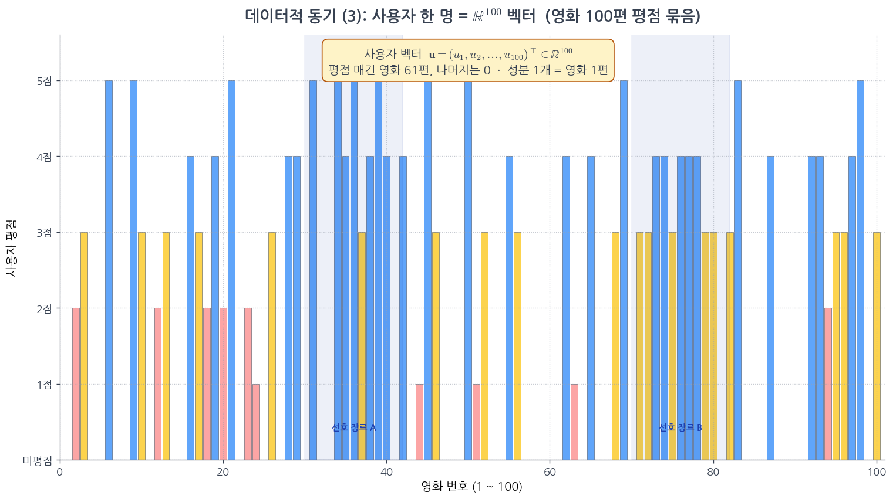
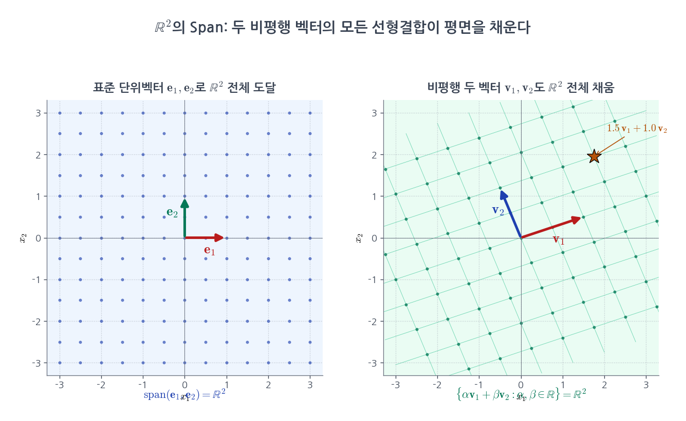
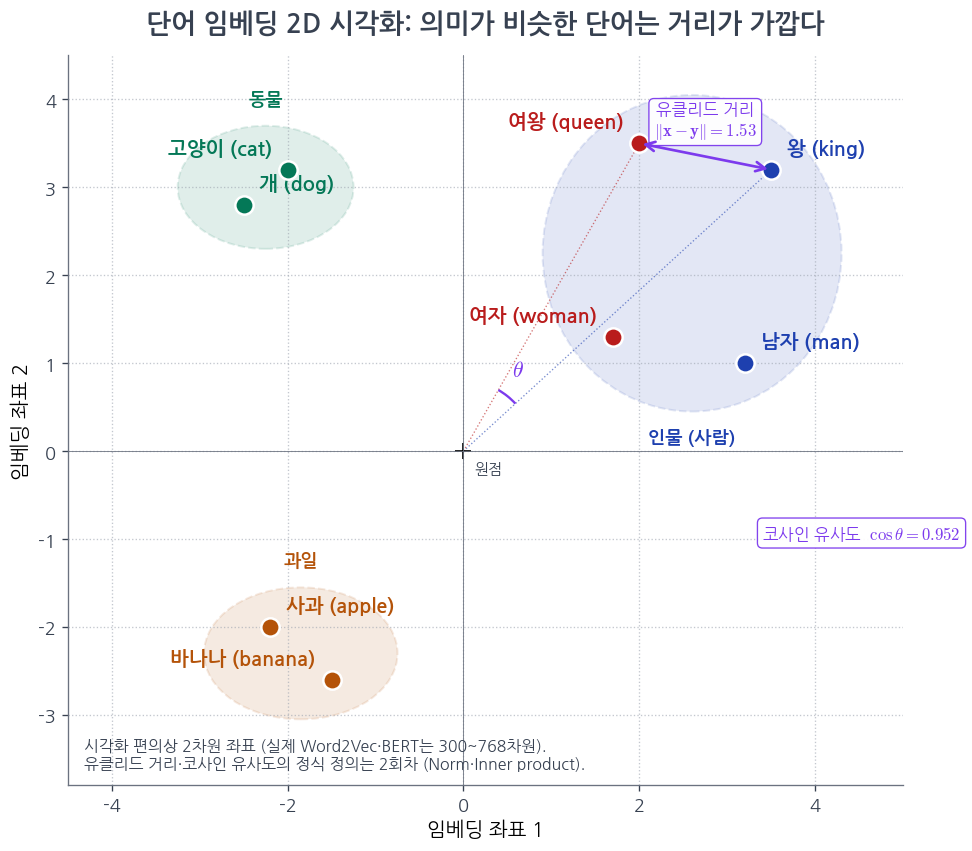

<!-- _class: lead -->
<!-- _paginate: false -->

# Part 1 1회차

## Vector(벡터)·$\mathbb{R}^n$·Linear combination(선형결합)

MML §2.1 (메인) · Strang Ch 1.1 (발췌) · [EoLA Ch.1: Vectors](https://www.youtube.com/watch?v=fNk_zzaMoSs) · [EoLA Ch.2: Linear combinations, span, basis](https://www.youtube.com/watch?v=k7RM-ot2NWY) · Part 1 (LA1)
**Part 1 (LA1) 첫 회차**, $\mathbb{R}^n$ 위에서 가장 단순한 두 연산 (덧셈·Scalar곱)부터 시작합니다.

> $\mathbb{R}^n$은 $n$개 실수를 한 묶음으로 본 공간입니다 (정확한 정의는 B-2).

---

<!-- _class: exercise -->

# Review: 지난 회차 마무리 문제

지난 회차에서 제기한 두 문제 (0회차 객체만으로 답합니다):

> **(a)** MNIST 숫자 "7" 이미지 $n$장 $\mathbf{x}_1, \ldots, \mathbf{x}_n$의 평균 이미지 $\mathbf{m}$을 Vector·Linear combination 두 단어로 한 줄로 표기.
> **(b)** 평균 이미지 $\mathbf{m}$이 다시 $\mathbb{R}^{784}$ 안의 Vector가 되는 이유를 한 줄로.

---

<!-- _class: exercise -->

# Review: 답

- **(a)** 평균 Vector의 정의식
   $$\mathbf{m} \;=\; \frac{1}{n}\sum_{i=1}^{n} \mathbf{x}_i \;=\; \frac{1}{n}\mathbf{x}_1 + \frac{1}{n}\mathbf{x}_2 + \cdots + \frac{1}{n}\mathbf{x}_n.$$
   각 이미지를 $\frac{1}{n}$ 배율로 합친 **Linear combination**(선형결합)이며, 결과는 또 하나의 Vector $\in \mathbb{R}^{784}$이다.

- **(b)** $\mathbf{m}$이 $\mathbf{x}_1, \ldots, \mathbf{x}_n \in \mathbb{R}^{784}$의 **Linear combination**이고, $\mathbb{R}^{784}$는 Vector를 Linear combination해도 Vector 그대로이기 때문 (오늘 정식화할 핵심 사실).

---

<!-- _class: exercise -->

# Review: 핵심 관찰

(a)의 한 줄은 본 회차에서 정식화될 모든 객체를 담고 있다: $\mathbb{R}^{784}$ Vector, 두 연산(덧셈·Scalar곱), 그리고 둘을 합친 Linear combination. 평균 이미지가 다시 이미지인 이유는 "Vector를 Linear combination해도 Vector이다"라는 본 회차 핵심 사실에서 비롯된다.

본 회차는 그 토대인 **Vector·$\mathbb{R}^n$·Linear combination**을 정식으로 도입한다. 평균 Vector $\mathbf{m}$의 정의에 본 회차 핵심 객체가 모두 포함된다.

---

## 본 회차 핵심 질문

> ### "수의 묶음"을 한 객체로 본다는 것은 무엇이고, 그 객체로 무엇을 할 수 있습니까?

이 한 질문에 답하려면 세 단계가 필요합니다.

1. **Vector**가 무엇이고 어떤 공간 $\mathbb{R}^n$에 사는지
2. **두 연산**, 덧셈·Scalar(스칼라)곱이 자연스럽다는 사실
3. **Linear combination(선형결합) · Span(생성공간)**, 두 연산이 만들어내는 모든 결과의 집합

본 회차의 모든 결과는 이 순서를 따른다. 강의 중간에 길을 잃으면 이 질문으로 돌아옵니다.

---

## 학습 목표

이번 회차가 끝나면 학생은 다음을 답할 수 있어야 합니다.

1. **Vector**의 수학적 정의와 그 의미를 물리·대수·데이터 세 관점에서 설명할 수 있습니다.
2. $\mathbb{R}^n$에서의 **덧셈·Scalar곱** 두 연산을 손계산으로 자유롭게 수행할 수 있습니다.
3. **Linear combination**(선형결합)의 정의와 "선형(linear)"이라는 명칭의 이유를 설명할 수 있습니다.
4. **Span(생성공간)의 직관**, 주어진 Vector들로 만들 수 있는 모든 결과의 집합을 설명할 수 있습니다.
5. **MNIST 이미지를 $\mathbb{R}^{784}$ Vector로** 보는 환원·평균 이미지 계산을 NumPy로 수행할 수 있습니다.

---

## 본 회차 학습 흐름

> 표의 식들 ($\alpha_1\mathbf{v}_1 + \cdots$, $\mathrm{span}$ 등)은 C 섹션에서 정식 도입됩니다. 표는 학습 흐름 안내입니다.

| 질문 | 답 (이 강의의 답) | 도구 |
|---|---|---|
| "수의 묶음"을 한 객체로? | **Vector**의 정의 | $\mathbf{x} \in \mathbb{R}^n$ |
| 그 객체에 가능한 두 연산? | **덧셈·Scalar곱** | $\mathbf{x}+\mathbf{y}$, $\alpha\mathbf{x}$ |
| 두 연산을 섞으면? | **Linear combination** | $\alpha_1\mathbf{v}_1 + \cdots + \alpha_k\mathbf{v}_k$ |
| 모든 결과의 집합? | **Span** (직관) | $\mathrm{span}(\cdots)$ |
| 가장 친숙한 예? | **MNIST 이미지** $\in \mathbb{R}^{784}$ | 평균 이미지 |
| 다음 회차로? | **길이·각도** | Norm · Inner product (2회차) |

본 회차는 이 순서를 따라 진행한다. 추상 정의 (Vector space 8 axioms · Subspace 정식 정의 · 일차독립)는 6·7·8회차에서 정식 도입합니다.

---

## 수업 흐름

| 순서 | 블록 | 내용 |
|:---:|:---:|---|
| ① | A | **오프닝**: 핵심 질문 + 0회차 Review + 본 회차 학습 흐름 |
| ② | **B** | **Vector**: 동기 3가지 + $\mathbb{R}^n$ 정의 + 두 연산 + 직관 예제 |
| ③ | **C** | **Linear combination · Span(직관)** + 3회차 미리보기 |
| ④ | **D** | **CS·AI 적용**: MNIST·텍스트·임베딩 |
| ⑤ | E | **코딩 실습(필요 시) + 클로징**: NumPy · $\mathbb{R}^2$ Span 시각화 · 마무리 문제 |

표준 사이클: **핵심 질문 → Review → 본 강의 → 마무리 문제 → 숙제 (= 다음 회차 Review)**

> **B와 C가 본 회차의 핵심입니다.**

---

# B. Vector: 동기와 정의

> "왜 Vector가 필요한가?" 세 가지 동기로 시작합니다.

## B-1. Vector가 왜 생겼는가: 세 가지 동기

**(i) 물리적 동기**: 크기 + 방향이 필요한 양 (변위·속도·힘)
- "북쪽 3 m"와 "동쪽 3 m"는 다릅니다, 같은 크기지만 방향이 다르면 다른 양.
- 두 변위의 합 = **평행사변형 법칙**.

**(ii) 대수적 동기**: 동시에 여러 양을 다루기
- $\begin{cases} 2x + 3y = 5 \\ x - y = 1 \end{cases}$ — $(x, y)$를 한 묶음으로 봅니다.
- 미지수가 100개라면 묶음 없이는 식조차 쓸 수 없습니다.

---

## B-1 (i) 물리적 동기: 평행사변형 법칙

두 벡터 $\mathbf{u}, \mathbf{v}$를 평행이동해 만든 평행사변형의 **대각선**이 곧 합 $\mathbf{u}+\mathbf{v}$이다. 합 연산이 두 벡터의 순서에 의존하지 않는다는 사실 (교환법칙) 이 그림에서 바로 보인다.



---

## B-1 (ii) 대수적 동기: $A\mathbf{x}=\mathbf{b}$

5개 방정식·5개 미지수를 **하나의 행렬 방정식**으로 압축한다. 미지수가 100개·1000개로 늘어나도 같은 한 줄 표기 $A\mathbf{x}=\mathbf{b}$가 유지된다.



---

**(iii) 데이터적 동기 (AI)**: 측정값의 묶음
- 이미지 한 장 = 픽셀 784개의 묶음
- 문서 한 개 = Embedding 좌표 768개의 묶음
- 사용자 한 명 = 영화 평점 100개의 묶음

> Embedding(임베딩)은 단어·문장을 수의 묶음 (Vector)으로 바꾼 좌표입니다. 정식 등장은 D-4.

세 동기 모두 **덧셈과 Scalar곱**이 자연스러운 두 연산입니다.

> **Strang Ch 1.1 발췌**: 두 Vector $\mathbf{v}, \mathbf{w}$에 대해 모든 Linear combination $c\mathbf{v} + d\mathbf{w}$ ($c, d \in \mathbb{R}$)의 집합이 LA의 출발점이라는 사실을 강조한다. 평행사변형 법칙과 같은 직관 그림이 본 회차 B-4·C-4의 토대이다.

---

## B-1 (iii-a) 이미지 한 장 = $\mathbb{R}^{784}$ 벡터

$28\times 28$ 픽셀 격자를 한 줄로 펼쳐 **길이 784 벡터**로 본다. 픽셀 인덱스 $(i,j)$는 1차원 인덱스 $k=28i+j$로 재배열된다.



---

## B-1 (iii-b) 문서 한 개 = $\mathbb{R}^{768}$ 벡터

BERT 같은 언어 모델은 문서를 $\mathbb{R}^{768}$의 한 점으로 매핑한다. **숫자 768개**가 그 문서의 의미 좌표가 된다.



---

## B-1 (iii-c) 사용자 한 명 = $\mathbb{R}^{100}$ 벡터

영화 100편 평점을 한 줄로 모으면 사용자가 $\mathbb{R}^{100}$의 한 점이 된다. 평점이 비슷한 사용자끼리는 이 공간 안에서 가깝다 (다음 회차 코사인 유사도).



---

## B-2. $\mathbb{R}^n$의 Vector: 형식적 정의

### 정의 1.1 ($\mathbb{R}^n$의 Vector)
$n$개 실수 순서쌍이다. 본 강의의 기본 표기는 **Column vector**(열벡터)이다.

$$\mathbf{x} = \begin{pmatrix} x_1 \\ x_2 \\ \vdots \\ x_n \end{pmatrix} \in \mathbb{R}^n, \qquad \mathbf{x}^\top = (x_1, x_2, \ldots, x_n)$$

- $x_i \in \mathbb{R}$를 **성분**(component) 또는 **좌표**(coordinate)라 부른다.
- $n$을 **차원**(dimension)이라 부른다. $\mathbb{R}^3$의 Vector는 좌표 3개를 가진 한 점이다.
- 표기 관례: Vector는 **굵게** ($\mathbf{x}$), Scalar는 보통체 ($\alpha, x_i$).

---

### Row vector vs Column vector

> 표기 $^\top$ ('transpose', 전치)는 세로 묶음을 가로 묶음으로 뒤집는 기호입니다. 정식 정의는 3회차.

- $\mathbf{x}$ = 세로 묶음 (Column), $\mathbf{x}^\top$ = 가로 묶음 (Row).
- LA의 표준은 Column. Matrix·Vector 곱 $A\mathbf{x}$가 Column 기준으로 정의됩니다 (3회차).

> 표기 $A\mathbf{x}$는 Matrix와 Vector의 곱입니다. 정식 정의는 3회차.

---

## B-3. 두 연산 — 덧셈 · Scalar곱

### 정의 1.2 (덧셈)
같은 차원의 두 Vector의 합은 **성분별 합**입니다.
$$\mathbf{x} + \mathbf{y} = \begin{pmatrix} x_1 + y_1 \\ x_2 + y_2 \\ \vdots \\ x_n + y_n \end{pmatrix}$$

**차원이 다르면 합이 정의되지 않습니다** ($\mathbb{R}^3$ Vector + $\mathbb{R}^4$ Vector는 X).

---

### 정의 1.3 (Scalar곱)
실수 $\alpha \in \mathbb{R}$와 Vector $\mathbf{x} \in \mathbb{R}^n$의 곱은 **성분별 Scalar 곱**입니다.
$$\alpha\mathbf{x} = \begin{pmatrix} \alpha x_1 \\ \alpha x_2 \\ \vdots \\ \alpha x_n \end{pmatrix}$$

- $\alpha > 0$: 같은 방향, 크기 $\alpha$배
- $\alpha < 0$: **반대 방향**, 크기 $|\alpha|$배
- $\alpha = 0$: **영Vector** $\mathbf{0} = (0, 0, \ldots, 0)^\top$

---

## B-4. 두 연산의 직관: 그림으로

<div class="analogy">

**직관 (수치 측정의 묶음)**: Vector는 한 객체를 기술하는 **여러 측정값의 묶음**이다. 한 환자의 (혈압, 맥박, 체온) = $(120, 72, 36.5)^\top \in \mathbb{R}^3$는 한 Vector이다. **Scalar곱**: 모든 측정값을 같은 비율로 확대·축소 (단위 변환). **덧셈**: 같은 종류의 두 묶음을 성분별로 합산 (두 측정 결과의 누적). 두 연산이 모두 성분별로 정의된다는 점이 정의 1.2·1.3의 핵심이다.

</div>

### 그림 직관 ($\mathbb{R}^2$)
- $\mathbf{x} + \mathbf{y}$: $\mathbf{x}$의 끝에서 $\mathbf{y}$를 이어 붙이기 = **평행사변형 법칙**
- $\alpha\mathbf{x}$ ($\alpha > 1$): $\mathbf{x}$를 같은 방향으로 **늘리기**
- $-\mathbf{x}$: $\mathbf{x}$를 **뒤집기** (반대 방향)
- $\mathbf{0}$: **원점** (모든 성분 0)

### 예제
$\mathbf{u} = \begin{pmatrix} 1 \\ 2 \end{pmatrix}$, $\mathbf{v} = \begin{pmatrix} 3 \\ 1 \end{pmatrix}$일 때

$$\mathbf{u} + \mathbf{v} = \begin{pmatrix} 4 \\ 3 \end{pmatrix}, \qquad 2\mathbf{u} = \begin{pmatrix} 2 \\ 4 \end{pmatrix}, \qquad \mathbf{u} - \mathbf{v} = \begin{pmatrix} -2 \\ 1 \end{pmatrix}$$

---

## B-5. 두 연산이 잘 동작합니다 (6회차에서 정식화)

$\mathbb{R}^n$에서 덧셈·Scalar곱이 가진 자연스러운 성질들:

- $\mathbf{u} + \mathbf{v} = \mathbf{v} + \mathbf{u}$ (교환법칙)
- $(\mathbf{u} + \mathbf{v}) + \mathbf{w} = \mathbf{u} + (\mathbf{v} + \mathbf{w})$ (결합법칙)
- $\mathbf{u} + \mathbf{0} = \mathbf{u}$ (덧셈 항등원)
- $\mathbf{u} + (-\mathbf{u}) = \mathbf{0}$ (역원)
- $\alpha(\beta\mathbf{u}) = (\alpha\beta)\mathbf{u}$
- $\alpha(\mathbf{u} + \mathbf{v}) = \alpha\mathbf{u} + \alpha\mathbf{v}$ 등 분배법칙

이 성질들을 한 데 묶어 **Vector space의 8 axioms** (공리)이라 부른다. **정식 정의는 6회차에서 도입**한다. 그때까지는 $\mathbb{R}^n$이 위 성질을 모두 만족한다는 사실만 받아들인다.

---

## B-6. 영Vector와 표준 단위Vector

### 영Vector
$$\mathbf{0} = (0, 0, \ldots, 0)^\top \in \mathbb{R}^n$$
모든 Vector $\mathbf{x}$에 대해 $\mathbf{x} + \mathbf{0} = \mathbf{x}$, $0 \cdot \mathbf{x} = \mathbf{0}$. **원점에 해당**한다.

### 표준 단위Vector (Standard basis vector)
$\mathbb{R}^n$에서 $i$번째 성분만 1이고 나머지는 0인 Vector:
$$\mathbf{e}_1 = \begin{pmatrix} 1 \\ 0 \\ \vdots \\ 0 \end{pmatrix},\;\mathbf{e}_2 = \begin{pmatrix} 0 \\ 1 \\ \vdots \\ 0 \end{pmatrix},\;\ldots,\;\mathbf{e}_n = \begin{pmatrix} 0 \\ 0 \\ \vdots \\ 1 \end{pmatrix}$$

**관찰**: 임의의 $\mathbf{x} = (x_1, \ldots, x_n)^\top$를
$$\mathbf{x} = x_1\mathbf{e}_1 + x_2\mathbf{e}_2 + \cdots + x_n\mathbf{e}_n$$
으로 쓸 수 있다. **모든 Vector가 $\mathbf{e}_1, \ldots, \mathbf{e}_n$의 Linear combination**이며, 이것이 C 섹션의 핵심 출발점이다.

---

<!-- _class: exercise -->

# 잠깐 풀어보기: Vector와 두 연산

옆 사람과 5분 토의 후 답을 종이에 적어보세요.

### 문제 1 (계산)
$\mathbf{u} = (1, -2, 3)^\top$, $\mathbf{v} = (2, 0, -1)^\top$일 때 다음을 계산하시오.
- (a) $\mathbf{u} + \mathbf{v}$
- (b) $2\mathbf{u} - 3\mathbf{v}$
- (c) $\mathbf{u}$와 같은 방향이지만 크기가 절반인 Vector

### 문제 2 (개념)
$\mathbb{R}^3$에서 $\mathbf{x} = 2\mathbf{e}_1 - 3\mathbf{e}_2 + 5\mathbf{e}_3$를 성분 표기 $(x_1, x_2, x_3)^\top$로 적으시오.

> **힌트**: $\mathbf{e}_i$는 $i$번째 성분만 1인 Vector이다. 각 항이 어느 성분에 기여하는지만 보면 된다.

---

<!-- _class: exercise -->

## 잠깐 풀어보기: 답

### 문제 1
- (a) $\mathbf{u} + \mathbf{v} = (1+2,\,-2+0,\,3+(-1))^\top = (3, -2, 2)^\top$
- (b) $2\mathbf{u} = (2, -4, 6)^\top$, $3\mathbf{v} = (6, 0, -3)^\top$. $2\mathbf{u} - 3\mathbf{v} = (-4, -4, 9)^\top$
- (c) $\frac{1}{2}\mathbf{u} = (0.5, -1, 1.5)^\top$. Scalar $\alpha = 1/2$로 곱한다.

### 문제 2
$\mathbf{x} = 2\mathbf{e}_1 - 3\mathbf{e}_2 + 5\mathbf{e}_3 = (2, -3, 5)^\top$

> **메시지**: 표준 단위Vector를 사용한 표현이 곧 **성분 표기**이다. 거꾸로 모든 성분 표기는 $\mathbf{e}_i$의 Linear combination으로 풀어쓸 수 있다. C 섹션에서 본격 사용한다.

---

# C. Linear combination · Span (직관)

> 본 회차의 두 번째 핵심이다. 두 연산을 **섞어 쓰면** 무엇이 만들어지는가.

## C-1. Linear combination: 정의

### 정의 1.4 (Linear combination)
Vector $\mathbf{v}_1, \mathbf{v}_2, \ldots, \mathbf{v}_k \in \mathbb{R}^n$, Scalar $\alpha_1, \alpha_2, \ldots, \alpha_k \in \mathbb{R}$에 대해
$$\alpha_1 \mathbf{v}_1 + \alpha_2 \mathbf{v}_2 + \cdots + \alpha_k \mathbf{v}_k \;\in\; \mathbb{R}^n$$
를 **Linear combination**(선형결합)이라 부릅니다. $\alpha_i$를 **계수**(coefficient)라 합니다.

### 예제
- $\mathbf{v}_1 = \begin{pmatrix} 1 \\ 0 \end{pmatrix}$, $\mathbf{v}_2 = \begin{pmatrix} 0 \\ 1 \end{pmatrix}$이면
  - $3\mathbf{v}_1 + 2\mathbf{v}_2 = \begin{pmatrix} 3 \\ 2 \end{pmatrix}$
  - $-1\mathbf{v}_1 + 5\mathbf{v}_2 = \begin{pmatrix} -1 \\ 5 \end{pmatrix}$

---

## C-1. Linear combination: 계수의 의미

- 계수 $(\alpha_1, \alpha_2)$를 바꿀 때마다 다른 Vector가 나옵니다.

<div class="analogy">

**직관 (계수의 의미)**: 주어진 Vector $\mathbf{v}_1, \ldots, \mathbf{v}_k$를 고정하고 계수 $(\alpha_1, \ldots, \alpha_k)$를 바꾸는 일이 곧 Linear combination이다. 계수 묶음 $(\alpha_1, \ldots, \alpha_k) \in \mathbb{R}^k$ 한 점이 결과 Vector $\mathbf{v} = \sum_i \alpha_i \mathbf{v}_i$ 한 점에 대응한다. 따라서 모든 Linear combination을 모은 집합 (Span) 은 $\mathbb{R}^k \to \mathbb{R}^n$ 한 선형사상의 상 (image) 이다.

</div>

계수 $\alpha_i$는 양수·음수·0 어느 것이든 가능하다. 모두 0이면 결과는 영Vector $\mathbf{0}$이다.

---

## C-2. "선형(linear)"의 의미

"Linear"는 **덧셈과 Scalar곱이라는 두 연산만 사용**한다는 뜻이다.

> 표 안의 $\|\cdot\|$은 Vector의 길이(Norm)로, 정식 도입은 2회차입니다. 여기서는 "길이 계산이 들어간 표현"이라는 직관만 챙기면 됩니다.

| 허용 (linear) | 금지 (비선형) |
|---|---|
| $\alpha\mathbf{v} + \beta\mathbf{w}$ | $v_1 \cdot w_1$ (성분끼리 곱) |
| $-\mathbf{v}$ | $v_1^2$ (성분 제곱) |
| $\mathbf{v} + \mathbf{w} + \mathbf{u}$ | $\exp(v_1)$, $\sin(v_1)$ |
| $\frac{1}{3}(\mathbf{v}_1 + \mathbf{v}_2 + \mathbf{v}_3)$ (평균) | $\Vert\mathbf{v}\Vert^2 \mathbf{w}$ (Norm 사용) |

**제한의 의미**: 두 연산만 쓰면 **수학적 분석이 가능**하다. 비선형이 들어가면 대수 구조가 깨져 일반 이론이 어렵다. 그래서 LA는 "Linear"라는 한 단어에 모든 것이 응축된다.

> **AI 모델의 비선형성**: 신경망의 **활성화 함수** (ReLU·sigmoid 등)가 비선형 부분을 담당합니다. 가중치 곱·합은 linear, 활성화는 비선형, **두 부분이 분리**되어 있어 각각을 따로 분석할 수 있습니다 (5회차·Part 2 2회차). 예: ReLU는 $\max(0, x)$, sigmoid는 $1/(1+e^{-x})$.

---

## C-3. Span (직관): 만들 수 있는 모든 Vector의 집합

### 정의 1.5 (Span, 직관적 정의)
Vector $\mathbf{v}_1, \ldots, \mathbf{v}_k \in \mathbb{R}^n$이 주어졌을 때, 가능한 **모든** 계수 $\alpha_1, \ldots, \alpha_k$에 대한 Linear combination의 집합:

$$\mathrm{span}(\mathbf{v}_1, \ldots, \mathbf{v}_k) = \left\{ \alpha_1\mathbf{v}_1 + \cdots + \alpha_k\mathbf{v}_k \;:\; \alpha_i \in \mathbb{R} \right\}$$

이를 **$\mathbf{v}_1, \ldots, \mathbf{v}_k$의 Span** (생성공간)이라 부른다. 즉 "주어진 Vector로 **만들 수 있는 모든 결과**의 묶음"이다.

<div class="analogy">

**직관 (Span의 의미)**: Span은 주어진 Vector $\mathbf{v}_1, \ldots, \mathbf{v}_k$의 **모든** Linear combination을 모은 집합이다. 본래 Vector들의 일차결합으로 얻을 수 없는 Vector는 Span에 속하지 않는다. 따라서 Span은 본래 Vector들이 도달 가능한 모든 점의 집합이며, 그 도달 범위는 본래 Vector들의 방향에 의해 결정된다.

</div>

> **정식 정의는 8회차에서 도입합니다.** Subspace·Basis·Dimension과 함께 다루는 것이 자연스럽습니다. 본 회차에서는 "만들 수 있는 모든 결과의 집합"이라는 직관까지 다룹니다.

---

## C-4. Span의 직관: 그림으로

### $\mathbb{R}^2$의 예
- $\mathrm{span}((1, 0)^\top)$ = **x축 직선** (모든 $\alpha(1,0)^\top = (\alpha, 0)$)
- $\mathrm{span}((1, 0)^\top, (0, 1)^\top)$ = **$\mathbb{R}^2$ 전체** (모든 점이 $\alpha\mathbf{e}_1 + \beta\mathbf{e}_2$로 표현됨)
- $\mathrm{span}((1, 1)^\top, (2, 2)^\top)$ = **$(1,1)^\top$ 방향 직선** (두 Vector가 평행이므로 새 방향 정보 없음)

### $\mathbb{R}^3$의 예
- $\mathrm{span}((1, 0, 0)^\top)$ = x축 직선
- $\mathrm{span}((1, 0, 0)^\top, (0, 1, 0)^\top)$ = xy 평면
- $\mathrm{span}((1, 0, 0)^\top, (0, 1, 0)^\top, (0, 0, 1)^\top)$ = $\mathbb{R}^3$ 전체

### 핵심 관찰
**Vector 개수 ≠ Span의 차원**이다. $(1,1)^\top$과 $(2,2)^\top$는 두 개지만 Span은 1차원 직선이다. **"진짜 다른 방향"이 몇 개인가**가 차원이다. 8회차에서 **Linear independence**로 정식화한다.

---

## C-4 그림으로: $\mathbb{R}^2$의 Span

왼쪽: 표준 단위벡터 $\mathbf{e}_1,\mathbf{e}_2$의 모든 선형결합 $\alpha\mathbf{e}_1+\beta\mathbf{e}_2$가 격자로 평면을 채운다. 오른쪽: 비평행 두 벡터 $\mathbf{v}_1,\mathbf{v}_2$의 격자도 (모양은 비스듬해지지만) 같은 평면 전체를 채운다. **두 벡터의 방향이 달라도, 평행만 아니면 $\mathbb{R}^2$ 전체를 Span한다.**



---

## C-5. 표준 단위Vector의 Span은 $\mathbb{R}^n$ 전체

B-6에서 본 바와 같이 임의의 $\mathbf{x} \in \mathbb{R}^n$가
$$\mathbf{x} = x_1\mathbf{e}_1 + x_2\mathbf{e}_2 + \cdots + x_n\mathbf{e}_n$$
으로 표현된다. 따라서
$$\mathrm{span}(\mathbf{e}_1, \mathbf{e}_2, \ldots, \mathbf{e}_n) = \mathbb{R}^n$$

→ **$\mathbb{R}^n$ 전체가 $n$개 표준 단위Vector의 Span**이다. 이것이 $\mathbb{R}^n$이라는 공간을 "$n$차원"이라 부르는 이유이다.

### 일반화: Basis의 직관
$\mathbb{R}^n$을 Span하는 "최소한의 Vector 집합"이 곧 **Basis**(기저)이다. 표준 단위Vector $\{\mathbf{e}_1, \ldots, \mathbf{e}_n\}$이 **표준 Basis**이다.

> **Basis·Dimension의 정식 정의는 8회차에서 다룹니다.** 본 회차에서는 "$\mathbf{e}_1, \ldots, \mathbf{e}_n$로 $\mathbb{R}^n$ 전체를 만들 수 있다"는 직관까지 다룹니다.

---

## C-6. Linear combination = Matrix·Vector 곱 (3회차 미리보기)

본 회차에서 본 Linear combination은 곧 **Matrix·Vector 곱**과 같은 것이다.

> 표기 $\mathbb{R}^{m \times n}$은 $m$행 $n$열 실수 Matrix의 공간입니다. 정식 도입은 3회차.

$A \in \mathbb{R}^{m \times n}$, $\mathbf{x} \in \mathbb{R}^n$. $A$의 열을 $\mathbf{a}_1, \ldots, \mathbf{a}_n$이라 쓰면

$$A\mathbf{x} = x_1\mathbf{a}_1 + x_2\mathbf{a}_2 + \cdots + x_n\mathbf{a}_n$$

**Matrix·Vector 곱 = $A$의 열들의 Linear combination**이다 (Column picture 해석).

### 예시
$A = \begin{pmatrix} 1 & 3 \\ 2 & 4 \end{pmatrix}$, $\mathbf{x} = \begin{pmatrix} 5 \\ 6 \end{pmatrix}$
$$A\mathbf{x} = 5\begin{pmatrix} 1 \\ 2 \end{pmatrix} + 6\begin{pmatrix} 3 \\ 4 \end{pmatrix} = \begin{pmatrix} 5 \\ 10 \end{pmatrix} + \begin{pmatrix} 18 \\ 24 \end{pmatrix} = \begin{pmatrix} 23 \\ 34 \end{pmatrix}$$

→ **3회차에서 Row picture와 Column picture 두 해석을 정식 도입합니다.** 본 회차에서는 "Matrix·Vector 곱이 사실 Linear combination이다"라는 사실만 미리 다룹니다.

---

<!-- _class: exercise -->

# 잠깐 풀어보기: Linear combination·Span

### 문제 1 (계산)
$\mathbf{v}_1 = (1, 1)^\top$과 $\mathbf{v}_2 = (1, -1)^\top$이 주어졌다. $(3, 5)^\top$을 두 Vector의 Linear combination $\alpha_1\mathbf{v}_1 + \alpha_2\mathbf{v}_2$로 표현하시오.

### 문제 2 (개념)
다음 Span을 그림 또는 말로 묘사하시오 (직선·평면·공간 전체·한 점 중 어느 것?).

- (i) $\mathrm{span}((1, 0)^\top, (0, 1)^\top, (1, 1)^\top)$ ⊂ $\mathbb{R}^2$
- (ii) $\mathrm{span}((1, 2, 0)^\top, (2, 4, 0)^\top)$ ⊂ $\mathbb{R}^3$
- (iii) $\mathrm{span}(\mathbf{0})$ ⊂ $\mathbb{R}^n$

> **힌트**: 두 Vector가 평행하면 Span은 한 직선에 머문다. $\mathbf{0}$만으로는 자기 자신밖에 만들 수 없다.

---

<!-- _class: exercise -->

## 잠깐 풀어보기: 답

### 문제 1
$\alpha_1 + \alpha_2 = 3$, $\alpha_1 - \alpha_2 = 5$ → $\alpha_1 = 4, \alpha_2 = -1$.

$$\therefore (3, 5)^\top = 4\,(1, 1)^\top - 1\,(1, -1)^\top$$

검증: $4(1,1)^\top - (1,-1)^\top = (4,4)^\top - (1,-1)^\top = (3, 5)^\top$ ✓

### 문제 2
- **(i)** $(1,1)^\top = (1,0)^\top + (0,1)^\top$이므로 셋째 Vector는 처음 둘의 Linear combination이다. 처음 두 Vector만으로 이미 $\mathbb{R}^2$ 전체를 Span한다. → **$\mathbb{R}^2$ 전체** (평면 전체).
- **(ii)** $(2, 4, 0)^\top = 2 \cdot (1, 2, 0)^\top$이므로 두 Vector가 평행하다. → **xy평면 위의 한 직선** ($(1, 2, 0)^\top$ 방향).
- **(iii)** $\alpha \cdot \mathbf{0} = \mathbf{0}$이므로 어떤 $\alpha$를 잡아도 $\mathbf{0}$이다. → **원점 한 점만**.

> **메시지**: Vector 개수 ≠ Span의 차원이다. **"진짜 다른 방향" 개수**가 차원이다. 8회차에서 **Linear independence**로 정식화한다.

---

# D. CS·AI 적용: 데이터를 Vector로

> 본 회차에서 본 수학이 AI에서 어디에 등장하는가.

## D-1. 이미지를 Vector로: MNIST

손글씨 숫자 데이터셋 **MNIST**: 28×28 픽셀 흑백 이미지 70,000장.

| 표현 | 객체 | 차원 |
|---|---|---|
| 이미지 한 장 | 28×28 픽셀 격자 | 2D 배열 |
| **펼친 형태 (flatten)** | 길이 784 Vector | $\mathbb{R}^{784}$ |
| 데이터셋 전체 | $n \times 784$ 표 | $\mathbb{R}^{n \times 784}$ Matrix |

**펼치는 이유**: 픽셀의 공간 구조는 **CNN** (Part 4 6회차)에서 다시 살린다. 우선은 **"한 장 = 한 Vector"** 로 보는 것이 LA의 표준 환원이다.

<div class="analogy">

**직관 (Flatten의 의미)**: $28 \times 28$ 격자 픽셀을 $\mathbb{R}^{784}$ Vector로 펼치는 일은 2차원 인덱스 $(i, j)$를 1차원 인덱스 $k = 28i + j$로 재배열하는 일이다. 픽셀 값 자체는 보존되지만 행·열 인접 관계 (공간 구조) 는 인덱스 안에 암묵화된다. 이 표현이 LA의 표준 환원이며, 공간 구조를 명시적으로 활용하는 표현은 Part 4 6회차 CNN·Toeplitz에서 다시 도입한다.

</div>

---

## D-2. MNIST 평균 이미지: 두 연산만으로

0회차 시그니처 예제을 재해석한다.

숫자 "7"인 이미지 1,000장 $\mathbf{x}_1, \mathbf{x}_2, \ldots, \mathbf{x}_{1000} \in \mathbb{R}^{784}$의 **평균 Vector**:

> $\sum_{i=1}^k$는 $i=1$부터 $k$까지의 항을 모두 더하라는 표기입니다.

$$\mathbf{m} = \frac{1}{1000}\sum_{i=1}^{1000}\mathbf{x}_i = \frac{1}{1000}(\mathbf{x}_1 + \mathbf{x}_2 + \cdots + \mathbf{x}_{1000})$$

이 한 식 안에 본 회차 내용이 모두 들어 있다:

- "이미지를 Vector로 본다", **B 섹션 (Vector 정의)**
- "Vector들을 더한다", **B 섹션 (덧셈)**
- "$\frac{1}{1000}$을 곱한다", **B 섹션 (Scalar곱)**
- "$\frac{1}{n}\sum$ 자체", **C 섹션 (계수가 모두 $\frac{1}{1000}$인 Linear combination)**

→ 평균 이미지 = **모든 이미지의 Linear combination** (계수가 균등). 결과는 "7의 본질" 같은 흐릿한 7 모양으로 나타난다 (0회차에서 본 그림).

---

## D-3. 텍스트·문서·사용자도 Vector로

이미지뿐 아니라 모든 데이터가 Vector로 환원된다.

| 데이터 | Vector 표현 | 차원 |
|---|---|---|
| **이미지** (MNIST) | 픽셀 펼치기 | $\mathbb{R}^{784}$ |
| **이미지** (ImageNet 224×224 RGB) | 픽셀 펼치기 | $\mathbb{R}^{150{,}528}$ |
| **단어** (Word2Vec) | Embedding(임베딩) 좌표 | $\mathbb{R}^{300}$ |
| **문장** (BERT) | Embedding 좌표 | $\mathbb{R}^{768}$ |
| **문장** (GPT-4) | Embedding 좌표 | $\mathbb{R}^{3072}$ (추정) |
| **사용자** (Netflix) | 영화별 평점 | $\mathbb{R}^{17{,}000}$ (영화 수) |
| **유전자 발현** | 유전자별 발현량 | $\mathbb{R}^{20{,}000}$ |

> 약어 안내: CNN(Convolutional Neural Network, 이미지 등 격자형 입력 신경망), Word2Vec·BERT·GPT-4는 대표적 단어·문장 임베딩·언어 모델. 정식 분해는 Part 4.

**모든 AI 모델의 입력 = $\mathbb{R}^d$ Vector**이다. 이미지는 작은 $d$, 텍스트는 중간, 유전자는 큰 $d$이다.

---

## D-4. Embedding(임베딩): 의미를 Vector로

<div class="analogy">

**직관 (Embedding의 의미)**: Embedding은 단어·문장 등 비수치 객체를 $\mathbb{R}^d$의 한 점으로 보내는 함수이다. 의미적으로 가까운 객체는 $\mathbb{R}^d$ 안에서 거리가 작도록, 의미적으로 먼 객체는 거리가 크도록 학습한다. 이렇게 얻은 좌표 위에서는 Norm·Inner product (2회차) 가 곧바로 의미 유사도의 척도가 된다.

</div>

### Embedding의 한 줄 정의
**문장·이미지·사용자 등 임의 객체를 $\mathbb{R}^d$ Vector로 보내는 함수**, 학습으로 얻는다.

### Vector여야 하는 이유
- Vector면 **덧셈·Scalar곱**이 정의됨 → 평균·차이 등 계산 가능
- 다음 회차의 **Norm·Inner product**가 정의됨 → 거리·각도 계산 가능
- Matrix 곱 (3회차) → **신경망 한 층 통과** 가능

→ **AI 모델은 모든 입력을 Vector로 바꾸는 것에서 시작**한다. 이것이 본 회차의 결론이다.

---

## D-4 그림으로: 단어 임베딩 2D 시각화

같은 의미 그룹 (인물·동물·과일) 안의 단어들이 평면 위에서 **가까운 점**으로 모인다. 단어 사이 거리는 곧 의미 거리이다. 거리 ($\|\mathbf{x}-\mathbf{y}\|$) 와 각도 (코사인 유사도) 의 정식 정의는 2회차에서 도입한다.



---

## D-5. 신경망 한 뉴런 미리보기

가장 간단한 인공 뉴런:

$$y = w_1 x_1 + w_2 x_2 + \cdots + w_n x_n + b$$

여기서 $\mathbf{x} = (x_1, \ldots, x_n)^\top$ = 입력 Vector, $\mathbf{w} = (w_1, \ldots, w_n)^\top$ = 가중치 Vector.

이 식의 본질:
- $w_i x_i$의 합 = **가중치 Vector와 입력 Vector의 곱셈 합** → **Inner product** (2회차)
- 더 일반화: $\mathbf{y} = W\mathbf{x} + \mathbf{b}$ → **Matrix·Vector 곱** (3회차)

> $\mathbf{b}$는 Bias(편향): 출력을 평행이동시키는 상수 Vector이다 (5회차·Part 2 2회차에서 본격).

→ 본 회차에서 본 Vector 정의 + 두 연산이 곧 **신경망의 한 줄**이다. 뉴런 한 개의 출력 = 입력 Vector의 한 가지 Linear combination + Bias.

---

## E-1. 코딩 실습 (필요 시): 골자

→ [Colab으로 실행](https://colab.research.google.com/github/repairer5812/linear-algebra-for-ai/blob/main/notebooks/Part1/01_%EB%B2%A1%ED%84%B0_R%5En_MNIST.ipynb)

> **Colab 실습 정책**: 매 회차 필수 X. 회차별 학습 가치에 따라 1-2개 또는 그 이상으로 운영한다. 본 회차는 0회차에서 이미 MNIST 평균을 다뤘으니 **$\mathbb{R}^2$ Span 시각화**가 가장 유의미한 활동이다. 시간이 부족하면 수학 정리·마무리 문제로 마치고 코딩은 과제로 돌릴 수 있다.

**핵심 활동: $\mathbb{R}^2$ Span 시각화**

1. 두 비평행 Vector $\mathbf{v}_1, \mathbf{v}_2 \in \mathbb{R}^2$를 정한다.
2. 격자 계수 $(\alpha, \beta) \in [-2, 2] \times [-2, 2]$에 대해 $\alpha\mathbf{v}_1 + \beta\mathbf{v}_2$를 그린다.
3. **평면 전체가 채워짐**을 눈으로 확인한다 ($\mathrm{span}(\mathbf{v}_1, \mathbf{v}_2) = \mathbb{R}^2$).
4. $\mathbf{v}_2$를 $2\mathbf{v}_1$로 바꿨을 때 **한 직선으로 무너짐**도 비교 (평행하면 차원이 줄어든다).

**보조 활동 (시간 남으면)**

- NumPy로 Vector 만들기·두 연산·표준 단위Vector·Linear combination 계산
- MNIST 1장 reshape·시각화 (0회차 예제의 한 장 단위 재현)

---

## E-2. NumPy 핵심 패턴

```python
import numpy as np

# Vector 만들기
u = np.array([1.0, -2.0, 3.0])
v = np.array([2.0, 0.0, -1.0])

# 두 연산
print(u + v)          # 덧셈
print(2 * u - 3 * v)  # Linear combination

# 표준 단위Vector
e = np.eye(3)         # 3x3 단위Matrix의 각 열이 e1, e2, e3
e1 = e[:, 0]          # (1, 0, 0)

# Linear combination을 한 줄로
vs = np.array([[1, 0], [0, 1], [1, 1]])  # 3개 Vector를 행으로
coefs = np.array([2, 3, -1])
result = coefs @ vs   # = 2*v1 + 3*v2 - v3

# MNIST → 784차원 Vector
from sklearn.datasets import load_digits
data = load_digits()
X = data.data         # (1797, 64) — 한 행이 한 이미지의 64차원 Vector
y = data.target       # (1797,) — 레이블
mean_seven = X[y == 7].mean(axis=0)  # (64,) — 7의 평균 Vector
```

---

## E-3. 차원·자료형 주의

NumPy에서 흔히 만나는 함정:

| 함정 | 증상 | 해결 |
|---|---|---|
| `np.array([1, 2])` + `np.array([1, 2, 3])` | shape 불일치 에러 | 차원 맞춘 뒤 덧셈 |
| 정수 Vector에 `0.5` 곱 | dtype에 따라 잘림 | `.astype(float)` 명시 |
| Row vector vs Column vector | `(n,)` vs `(n, 1)` 혼동 | LA에선 Column 표준, `.reshape(-1, 1)` |
| MNIST 픽셀 0~255 정수 | 평균에서 오버플로 가능성 | `.astype(np.float32) / 255.0` |

> **0회차 노트북에서 `astype(float)`을 한 이유**: 픽셀 평균을 계산할 때 정수형은 Scalar 곱이 깔끔하게 떨어지지 않습니다. Vector space의 두 연산이 잘 동작하려면 **실수 자료형**이 자연스럽습니다.

---

## E-4. 본 회차 핵심 5개

1. **Vector** = 같은 차원 실수들의 순서 묶음 ($\mathbb{R}^n$) + **두 연산** (덧셈·Scalar곱).
2. **두 연산**은 그림으로는 평행사변형 법칙과 늘이기·뒤집기이다. **성분별**로 자연스럽게 동작한다.
3. **Linear combination** = 두 연산을 섞은 일반 식 $\sum \alpha_i \mathbf{v}_i$. "선형"은 두 연산만 쓴다는 뜻이다.
4. **Span (직관)** = 주어진 Vector로 만들 수 있는 **모든 결과의 집합**. Vector 개수 ≠ 차원 (평행하면 차원이 줄어든다).
5. **MNIST 이미지 1장 = $\mathbb{R}^{784}$ Vector**. 모든 AI 모델의 입력은 결국 Vector로 환원된다. 평균 이미지 = 계수 균등한 Linear combination.

---

## E-5. 자기 점검 질문

- $\mathbf{u} = (1, 2, 3)^\top$, $\mathbf{v} = (-1, 0, 1)^\top$일 때 $3\mathbf{u} - 2\mathbf{v}$는?
- $\mathrm{span}((2, 4)^\top, (1, 2)^\top)$의 모양은 (직선·평면·한 점 중)?
- $\mathbb{R}^n$의 임의 Vector가 표준 단위Vector $\mathbf{e}_1, \ldots, \mathbf{e}_n$의 Linear combination으로 쓰이는 이유는?
- MNIST 28×28 이미지를 Vector로 만들면 차원은? 1,000장 데이터셋은 어떤 Matrix?
- "선형(linear)"이란 단어의 정확한 의미는 무엇입니까? 무엇이 허용되고 무엇이 금지됩니까?

---

<!-- _class: exercise -->

# 본 회차 마무리 문제 (즉석 풀이)

본 회차 학습 흐름 (Vector → 두 연산 → Linear combination → Span → MNIST)을 **한 문제**로 종합합니다.

$\mathbf{v}_1 = (1, 0, 1)^\top$, $\mathbf{v}_2 = (0, 1, 1)^\top$, $\mathbf{v}_3 = (1, 1, 2)^\top$가 $\mathbb{R}^3$에 주어졌다.

- **(a)** $\mathbf{w} = 2\mathbf{v}_1 + 3\mathbf{v}_2 - \mathbf{v}_3$를 계산하시오.
- **(b)** $\mathbf{v}_3$를 $\mathbf{v}_1, \mathbf{v}_2$의 Linear combination으로 표현할 수 있는가? 가능하면 계수를 구하시오.
- **(c)** $\mathrm{span}(\mathbf{v}_1, \mathbf{v}_2, \mathbf{v}_3)$는 $\mathrm{span}(\mathbf{v}_1, \mathbf{v}_2)$와 같은 집합인가? 그 이유는?
- **(d)** $\mathrm{span}(\mathbf{v}_1, \mathbf{v}_2)$는 $\mathbb{R}^3$의 어떤 모양인가 (직선·평면·전체 중)?

---

<!-- _class: exercise -->

## 본 회차 마무리 문제: 답

- **(a)** $2\mathbf{v}_1 = (2, 0, 2)^\top$, $3\mathbf{v}_2 = (0, 3, 3)^\top$, $-\mathbf{v}_3 = (-1, -1, -2)^\top$
  합: $(2-1,\,0+3-1,\,2+3-2)^\top = (1, 2, 3)^\top$

- **(b)** $\mathbf{v}_3 = (1, 1, 2)^\top = (1, 0, 1)^\top + (0, 1, 1)^\top = \mathbf{v}_1 + \mathbf{v}_2$. 가능하며, **계수 (1, 1)**.

- **(c)** **같은 집합이다.** $\mathbf{v}_3$가 $\mathbf{v}_1, \mathbf{v}_2$의 Linear combination이므로 $\mathbf{v}_3$를 추가해도 새로 만들 수 있는 Vector가 없다. ($\alpha_1\mathbf{v}_1 + \alpha_2\mathbf{v}_2 + \alpha_3\mathbf{v}_3 = (\alpha_1+\alpha_3)\mathbf{v}_1 + (\alpha_2+\alpha_3)\mathbf{v}_2$로 정리 가능)

- **(d)** $\mathbf{v}_1, \mathbf{v}_2$는 평행이 아니다 (한쪽이 다른 쪽의 Scalar 배가 아니다). 따라서 $\mathbb{R}^3$의 **한 평면** (원점을 지나는).

> **핵심**: 세 Vector 중 하나가 나머지의 Linear combination이면 Span에 기여하지 않는다. **"진짜 다른 방향" 개수가 차원**이다. 8회차 Linear independence의 핵심 직관이다.

---

<!-- _class: exercise -->

## 다음 회차 Review용 숙제

위 마무리 문제의 **유사 문제**이다. 강의 후 풀어 와서 **2회차 Review 시간**에 비교한다.

$\mathbf{u}_1 = (1, 2)^\top$, $\mathbf{u}_2 = (3, 4)^\top$, $\mathbf{u}_3 = (5, 6)^\top$이 $\mathbb{R}^2$에 주어졌다.

- (a) $\mathbf{w} = \mathbf{u}_1 - 2\mathbf{u}_2 + \mathbf{u}_3$를 계산하시오.
- (b) $\mathbf{u}_3$를 $\mathbf{u}_1, \mathbf{u}_2$의 Linear combination으로 표현할 수 있는가? 가능하면 계수를 구하시오. (힌트: 연립방정식)
- (c) $\mathrm{span}(\mathbf{u}_1, \mathbf{u}_2, \mathbf{u}_3)$는 $\mathbb{R}^2$의 어떤 모양인가?
- (d) MNIST 한 장의 이미지를 $\mathbb{R}^{784}$ Vector $\mathbf{x}$로 펼쳤다. 표준 단위 Vector $\mathbf{e}_1, \ldots, \mathbf{e}_{784}$ ($\mathbf{e}_i$ = 위치 $i$만 1, 나머지 0)의 Linear combination으로 $\mathbf{x}$를 표현하는 식을 **한 줄로** 적으시오. (각 픽셀을 손으로 다 풀어쓰라는 것이 아니라, 시그마 한 줄로 충분합니다.)
   - **답 형태 안내**: $\;\mathbf{x} = \sum_{i=1}^{784} x_i \mathbf{e}_i$, 여기서 $x_i$는 $i$번째 픽셀 값.

### 자기 점검

- (b)의 계수를 구하는 과정이 어떤 **연립 1차방정식**으로 환원되는지 확인한다. → 4회차 가우스 소거의 출발점.
- (d)에서 **픽셀값 $x_i$가 곧 표준 단위 Vector $\mathbf{e}_i$의 계수**이다. 모든 이미지는 결국 픽셀별 단위 Vector의 Linear combination이다. 식 한 줄에 본 회차 모든 객체 (Vector·Scalar곱·합·Linear combination)가 들어 있다.

---

## E-6. 과제 안내

`04_과제/Part1/01회차_homework.md` — 마감: 2회차 시작 전

**수학 30점**
- 두 연산 계산 (덧셈·Scalar곱·Linear combination), 5문제
- Span의 모양 식별 (직선·평면·전체), 3문제
- 한 Vector가 다른 Vector들의 Linear combination인지 판정, 3문제 (연립방정식 풀기)
- 표준 단위Vector $\mathbf{e}_i$를 사용한 분해, 2문제

**코딩 20점**
- NumPy로 Vector 생성·두 연산·Linear combination 구현
- MNIST 한 장 → 784차원 Vector로 reshape, 시각화로 원본 복원 확인
- 0~9 각 숫자의 평균 이미지 10장 계산·시각화
- **보너스**: 새 이미지를 가장 가까운 평균과 비교하여 분류 (다음 회차 Norm으로 자연스럽게 이어짐)

---

## E-7. 다음 회차 (2회차) 예고

**주제**: Length(길이, Norm) · Dot product(내적) · 각도 · Cauchy-Schwarz · Cosine similarity

**연결**: 본 회차에서 본 Vector와 두 연산만으로는 "두 Vector가 얼마나 비슷한가"를 잴 수 없습니다. 2회차에서 **Norm**(길이)과 **Inner product**(내적)라는 두 도구를 도입하여 거리·각도·코사인 유사도를 정의합니다. 0회차 Review에서 가져온 "MNIST 숫자 7과 새 이미지의 가까움"이 수학적으로 정의됩니다.

**3회차 예고**: 본 회차에서 본 Linear combination = Matrix·Vector 곱의 Column picture (3회차에서 본격).

**사전 reading**:
- **MML §3.1-§3.4** (Norms · Inner Products · Lengths and Distances · Angles and Orthogonality), 메인
- **Strang Ch 1.2** 발췌 (Cauchy-Schwarz 판별식 풀이), 본문 박스로 가져옴
- 3Blue1Brown EoLA Ch.9 (Dot products and duality)

---

# 부록: MML §2.1 · Strang Ch 1.1 추천 연습문제

본 회차에서 다룬 내용을 손으로 더 다루어 보고 싶은 학생을 위한 안내입니다 (모두 자율).

| 교재 | 주제 | 난도 |
|---|---|:---:|
| **MML §2.1 Exercise**: Vector·$\mathbb{R}^n$·linear combination 기초 | $\mathbb{R}^n$ 두 연산·linear combination 계산 | 하·중 |
| **Strang Ch 1.1 Problem 1-3** | 평행사변형 법칙·두 Vector 합 | 하 |
| **Strang Ch 1.1 Problem 5-8** | Linear combination 계수 구하기 | 중 |
| **Strang Ch 1.1 Problem 11-13** | $\mathbb{R}^3$에서 Span의 모양 식별 | 중 |
| **Strang Ch 1.1 Problem 17-20** | 표준 단위Vector·임의 Vector 분해 | 중 |
| **Strang Ch 1.1 Problem 23, 25** | "두 Vector의 모든 Linear combination이 평면을 이룬다"의 직관적 증명 | 상 |

> MML §2.1은 정식 정의를 다지고, Strang Ch 1.1 연습문제는 **개념 검증용 + 손계산용**이 섞여 있습니다. 본문을 읽고 3~5문제를 풀면 다음 회차 진입이 부드러워집니다.

---

<!-- _class: lead -->

# Q & A

본 회차 학습 흐름:
**Vector ($\mathbb{R}^n$) → 두 연산 (덧셈·Scalar곱) → Linear combination → Span(직관) → MNIST 이미지 Vector**

핵심 한 줄: **모든 데이터는 $\mathbb{R}^d$ Vector로 환원되고, 두 연산이 그 데이터를 다루는 모든 일의 출발점이다.**

다음 회차의 출발 문제:
> 두 Vector의 **길이**와 **각도**를 어떻게 정의하면 자연스러운가?

`HANDOUT`: 본 PDF + `01_벡터_R^n_MNIST.ipynb`
