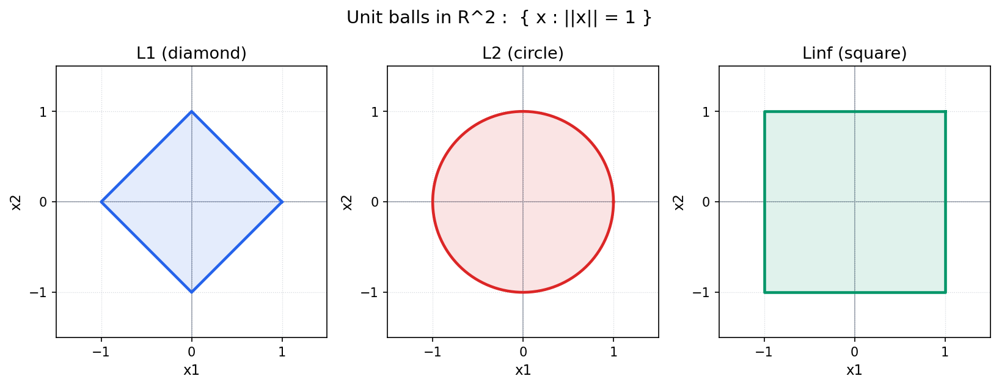
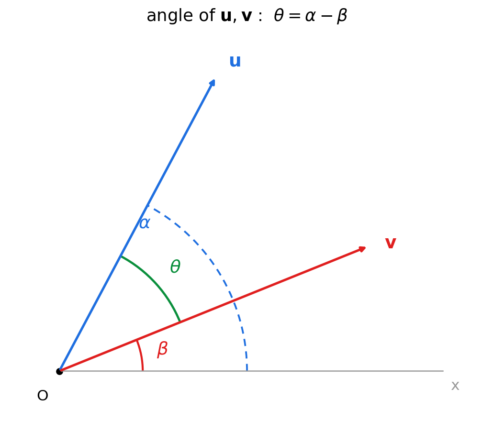

<!-- _class: lead -->
<!-- _paginate: false -->

# Part 1 2회차

## Norm·Dot product·Cosine similarity

MML §3.1-§3.4 (메인) · Strang Ch 1.2 (발췌, Cauchy-Schwarz 판별식 풀이) · [EoLA Ch.9: Dot products and duality](https://www.youtube.com/watch?v=LyGKycYT2v0) · Part 1 (LA1)

이제 Vector(벡터) 사이의 **거리와 각도**를 정의합니다.

---

# 지난 시간(1회차) 요약

> 흐름: **Vector → 두 연산 → Linear combination → Span → 데이터의 Vector화**

| 키워드 | 한 줄 정리 |
|---|---|
| **Vector $\in \mathbb{R}^n$** | 같은 차원 실수들의 순서 묶음 (성분 = 좌표) |
| **두 연산** | 덧셈(성분별 합)·Scalar곱(성분별 배) — 평행사변형·신축·반전 |
| **Linear combination** | $\alpha_1\mathbf{v}_1 + \cdots + \alpha_k\mathbf{v}_k$. "선형" = 두 연산만 사용 |
| **Span(직관)** | 만들 수 있는 모든 결과의 집합. **개수 ≠ 차원** (평행하면 직선) |
| **표준 단위Vector** | 임의 $\mathbf{x} = \sum_i x_i\mathbf{e}_i$ — 모든 Vector가 $\mathbf{e}_i$의 LC |
| **데이터 = Vector** | 이미지 $\in \mathbb{R}^{784}$, 신경망 한 층 $= W\mathbf{x} + \mathbf{b}$ |

**오늘과의 연결**: 1회차는 두 연산으로 Vector를 *만들었다*. 본 회차는 그 Vector의 **길이·각도**를 잰다.

---

<!-- _class: exercise -->

# Review: 1회차 마무리 숙제

지난 회차에서 낸 숙제(마무리 문제의 유사 문제)를 함께 확인합니다.

> $\mathbb{R}^2$의 Vector $\mathbf{u}_1 = (1, 2)^\top$, $\mathbf{u}_2 = (3, 4)^\top$, $\mathbf{u}_3 = (5, 6)^\top$이 주어졌다.
> **(a)** $\mathbf{w} = \mathbf{u}_1 - 2\mathbf{u}_2 + \mathbf{u}_3$를 계산하시오.
> **(b)** $\mathbf{u}_3$를 $\mathbf{u}_1, \mathbf{u}_2$의 Linear combination으로 표현할 수 있는가? 가능하면 계수를 구하시오. (힌트: 연립방정식)
> **(c)** $\mathrm{span}(\mathbf{u}_1, \mathbf{u}_2, \mathbf{u}_3)$는 $\mathbb{R}^2$의 어떤 모양인가?
> **(d)** MNIST 한 장을 $\mathbb{R}^{784}$ Vector $\mathbf{x}$로 펼쳤을 때, 표준 단위 Vector $\mathbf{e}_i$의 Linear combination으로 $\mathbf{x}$를 **한 줄로** 표현하시오.

---

<!-- _class: exercise -->

## Review: 답

- **(a)** $\mathbf{w} = (1,2) - (6,8) + (5,6) = (0, 0)^\top$. 즉 $\mathbf{u}_1 - 2\mathbf{u}_2 + \mathbf{u}_3 = \mathbf{0}$.
- **(b)** $\mathbf{u}_3 = -\mathbf{u}_1 + 2\mathbf{u}_2$, **계수 $(-1, 2)$**. (연립 $x_1 + 3x_2 = 5,\ 2x_1 + 4x_2 = 6$의 해)
- **(c)** $\mathbf{u}_1, \mathbf{u}_2$가 평행이 아니므로 이미 $\mathbb{R}^2$ 전체를 Span하고, $\mathbf{u}_3$는 이들의 Linear combination이라 기여하지 않는다 → $\mathbb{R}^2$ **전체**.
- **(d)** $\mathbf{x} = \sum_{i=1}^{784} x_i \mathbf{e}_i$ ($x_i$ = $i$번째 픽셀 값).

---

<!-- _class: exercise -->

## Review: 핵심 관찰

- $\mathbf{u}_3$가 $\mathbf{u}_1, \mathbf{u}_2$의 Linear combination이라는 (a)·(b)·(c)의 사실은 하나를 가리킨다: **한 Vector가 나머지의 Linear combination이면 Span에 기여하지 않는다** ("개수 ≠ 차원", 8회차 일차독립으로 이어짐).
- (d)는 **모든 $\mathbb{R}^n$ Vector가 표준 basis의 Linear combination**임을 보인다. 이 성분 표현이 본 회차 **Norm·Dot product를 성분별 계산으로 정의**할 수 있게 하는 출발점이다.

---

## 본 회차 핵심 질문

> ### 두 Vector의 **길이**와 **각도**를 어떻게 정의해야 $\cos\theta$가 자연스럽게 등장합니까?

이 한 질문에 답하려면 네 단계가 필요합니다.

1. **Norm**(노름): 한 Vector의 **길이**가 무엇인가
2. **Dot product**(내적): 두 Vector의 **관계**를 한 Scalar(스칼라)로 잡는 도구
3. **Cauchy-Schwarz inequality(코시-슈바르츠 부등식)**: $|\mathbf{u}\cdot\mathbf{v}| \le \|\mathbf{u}\|\|\mathbf{v}\|$ (C-4에서 증명)
4. **Cosine similarity(코사인 유사도)**: 위 3에서 자동으로 $\cos\theta \in [-1, 1]$이 보장된다.

---

## 학습 목표

이번 회차가 끝나면 학생은 다음을 답할 수 있어야 합니다.

1. **Euclidean norm(유클리드 노름)** $\|\mathbf{x}\|_2$를 정의하고, $\mathbb{R}^n$에서 세 가지 성질 (양정성(positive definiteness)·절대 동차성(absolute homogeneity)·삼각부등식(triangle inequality))을 확인할 수 있습니다. (세 가지 Norm 성질, B-3에서 정식 도입)
2. **Dot product** $\mathbf{u}\cdot\mathbf{v} = \sum u_i v_i$를 정의하고, $\mathbf{u}\cdot\mathbf{u} = \|\mathbf{u}\|_2^2$임을 손계산으로 확인할 수 있습니다.
3. **각도의 정의** $\cos\theta = \dfrac{\mathbf{u}\cdot\mathbf{v}}{\|\mathbf{u}\|\|\mathbf{v}\|}$가 2차원·3차원의 기하 직관과 일치함을 보일 수 있습니다.
4. **Cauchy-Schwarz inequality**를 $\mathbb{R}^n$에서 **이차식 판별식**으로 직접 증명할 수 있습니다.
5. **Cosine similarity**가 임베딩 비교의 표준인 이유 (스케일 불변성)를 설명하고, NumPy로 두 이미지·두 단어 임베딩의 cosine similarity를 계산할 수 있습니다.

---

## 본 회차 학습 흐름

| 질문 | 답 (이 강의의 답) | 도구 |
|---|---|---|
| 한 Vector의 **길이**? | **Euclidean norm** $\Vert\mathbf{x}\Vert_2 = \sqrt{\sum x_i^2}$ | 피타고라스 |
| 길이의 기본 성질은? | (N1) 양정성(positive definiteness) · (N2) 동차성(absolute homogeneity) · (N3) 삼각부등식(triangle inequality) | 세 검사 도구 |
| 두 Vector의 **관계**? | **Dot product** $\mathbf{u}\cdot\mathbf{v} = \sum u_i v_i$ | 성분별 곱의 합 |
| Norm과 Dot product의 관계? | $\Vert\mathbf{u}\Vert_2^2 = \mathbf{u}\cdot\mathbf{u}$ | 정의에서 직접 |
| **각도**를 어떻게 정의? | $\cos\theta := \dfrac{\mathbf{u}\cdot\mathbf{v}}{\Vert\mathbf{u}\Vert\,\Vert\mathbf{v}\Vert}$ | 2D·3D 기하 일치 |
| $\cos\theta \in [-1, 1]$ 보장? | **Cauchy-Schwarz** | 이차식 판별식 |
| AI 임베딩 비교? | **Cosine similarity** | 스케일 불변 |

---

# B. 수학 1: Norm, "길이"의 정확한 명세

> 1회차에서 본 한 Vector를 이제 **하나의 숫자 (크기)로 요약**한다.

## B-1. 길이를 정의해야 하는 이유

**문제 상황**: MNIST 평균 7 이미지 $\mathbf{m} \in \mathbb{R}^{784}$와 새 이미지 $\mathbf{x} \in \mathbb{R}^{784}$. 둘이 얼마나 비슷한가?

가장 자연스러운 답: **두 점 사이 거리** $\|\mathbf{x} - \mathbf{m}\|$.

→ 따라서 "거리"가 무엇인지부터 정의해야 한다.

<div class="analogy">

**기하적 해석**: Norm $\|\mathbf{x}\|$는 원점에서 점 $\mathbf{x}$까지의 거리이다. $\mathbb{R}^2$에서 $\mathbf{x} = (3, 4)$이면 $\|\mathbf{x}\| = \sqrt{3^2 + 4^2} = 5$ (피타고라스 정리). $\mathbb{R}^n$에서의 Euclidean norm $\|\mathbf{x}\|_2 = \sqrt{\sum_i x_i^2}$은 피타고라스 정리의 $n$차원 일반화이다.

</div>

---

## B-2. Euclidean norm의 정의

### 정의 2.1 (Euclidean norm, $\ell_2$ Norm)
$\mathbf{x} = (x_1, \ldots, x_n) \in \mathbb{R}^n$의 **Euclidean norm**:

> 표기 $:=$는 "좌변을 우변으로 **정의**한다"는 기호 (등호 $=$가 단순히 같음을 진술하는 것과 구별).

$$\|\mathbf{x}\|_2 := \sqrt{x_1^2 + x_2^2 + \cdots + x_n^2} = \sqrt{\sum_{i=1}^n x_i^2}$$

본 강의에서 별도 표기가 없으면 $\|\mathbf{x}\| := \|\mathbf{x}\|_2$로 약속한다. 이후 본문·증명·계산에서 단독 $\|\cdot\|$는 모두 $\ell_2$ Norm을 가리킨다.

---

## B-2. Euclidean norm: 피타고라스 확장

### 동기: 피타고라스의 $n$차원 확장
- $\mathbb{R}^2$: $\sqrt{x_1^2 + x_2^2}$, 직각삼각형 빗변.
- $\mathbb{R}^3$: $\sqrt{x_1^2 + x_2^2 + x_3^2}$, 직육면체 대각선.
- $\mathbb{R}^n$: 같은 공식이 그대로 자연스럽다.

### 예제
- $\mathbf{x} = (3, 4)$: $\|\mathbf{x}\| = \sqrt{9 + 16} = 5$
- $\mathbf{x} = (1, 2, 2)$: $\|\mathbf{x}\| = \sqrt{1 + 4 + 4} = 3$
- $\mathbf{x} = (2, -3, 1, -4)$: $\|\mathbf{x}\| = \sqrt{4 + 9 + 1 + 16} = \sqrt{30} \approx 5.48$

---

## B-3. Norm의 세 가지 성질 ($\mathbb{R}^n$에서 검증)

Euclidean norm의 세 가지 성질: "길이"는 음수일 수 없고, 2배로 늘리면 길이도 2배이며, 직진이 우회보다 짧다.

| 성질 | 식 | 의미 |
|---|---|---|
| (N1) **양정성** (positive definiteness) | $\Vert\mathbf{x}\Vert \ge 0$, $\Vert\mathbf{x}\Vert = 0 \iff \mathbf{x} = \mathbf{0}$ | 거리는 음수 X, 거리 0은 같은 점 |
| (N2) **절대 동차성** (absolute homogeneity) | $\Vert\alpha\mathbf{x}\Vert = \lvert\alpha\rvert\,\Vert\mathbf{x}\Vert$ | $\alpha$배로 늘리면 길이도 $\lvert\alpha\rvert$배 |
| (N3) **삼각부등식** (triangle inequality) | $\Vert\mathbf{x} + \mathbf{y}\Vert \le \Vert\mathbf{x}\Vert + \Vert\mathbf{y}\Vert$ | 직진 ≤ 우회 |

> 표기 $\iff$는 "필요충분조건" (양쪽이 동시에 참).

---

## B-3. Norm 세 가지 성질: (N1)·(N2) 검증

### $\mathbb{R}^n$에서 (N1)·(N2) 검증

- **(N1)**: $x_i^2 \ge 0$이므로 $\sum x_i^2 \ge 0$이다. 등호는 모든 $x_i = 0$일 때만 성립한다.
- **(N2)**: $\|\alpha\mathbf{x}\|^2 = \sum (\alpha x_i)^2 = \alpha^2 \sum x_i^2$. 제곱근을 씌우면 $|\alpha|\,\|\mathbf{x}\|$이다.

→ (N3) 삼각부등식(triangle inequality)은 **Cauchy-Schwarz의 결과**로 C 섹션에서 증명한다.

---

## B-4. 보조 Norm: $\ell_1, \ell_\infty$ (Strang 보조)

같은 Vector의 "크기"를 재는 다른 잣대들:

| Norm | 정의 | 직관·응용 |
|---|---|---|
| $\ell_1$ (Manhattan) | $\sum_i \lvert x_i \rvert$ | 격자 도시(택시) · **Lasso (sparse)** |
| $\ell_2$ (Euclidean) | $\sqrt{\sum_i x_i^2}$ | **피타고라스** · 거의 모든 LA · Ridge |
| $\ell_\infty$ (Chebyshev) | $\max_i \lvert x_i \rvert$ | 최악 경우 · 안정성 분석 |

> Lasso·Ridge는 머신러닝의 정규화 기법, Part 4 1회차에서 본격.

---

## B-4. 보조 Norm: 예제

### 예제: 같은 Vector, 세 가지 크기
$\mathbf{a} = (3, 1, -2, 4) \in \mathbb{R}^4$:
- $\|\mathbf{a}\|_1 = 3 + 1 + 2 + 4 = 10$, 성분 절댓값의 합
- $\|\mathbf{a}\|_2 = \sqrt{9 + 1 + 4 + 16} = \sqrt{30} \approx 5.48$, 성분 제곱합의 제곱근 (Euclidean)
- $\|\mathbf{a}\|_\infty = \max\{3,1,2,4\} = 4$, 성분 절댓값의 최댓값

본 회차는 **$\ell_2$ 중심**이다. $\ell_1, \ell_\infty$는 Part 2 2회차 (정사영·정규화)에서 본격적으로 다룬다.

---

## B-5. Unit ball(단위구)의 모양

$\mathbb{R}^2$의 Unit ball $\{\mathbf{x} : \|\mathbf{x}\| = 1\}$은 Norm마다 다르다: $\ell_1$ → **마름모**(꼭짓점이 좌표축 위), $\ell_2$ → **원**, $\ell_\infty$ → **정사각형**. 같은 "크기 1"이지만 모양이 다르며, 어떤 Norm을 쓰느냐가 "어디까지가 가까운가"의 범위를 다르게 정의한다.



---

## B-5. Unit ball: 각 곡선의 유도

각 곡선은 정의 방정식에서 직접 나온다.

- $\ell_1$: $|x_1|+|x_2|=1$. 제1사분면에서는 $x_1+x_2=1$, 즉 $(1,0)$과 $(0,1)$을 잇는 직선이다. 네 사분면의 부호 대칭으로 직선 4개가 모여 꼭짓점이 좌표축 위에 있는 **마름모**가 된다.
- $\ell_2$: $x_1^2+x_2^2=1$. 반지름 1인 **원**의 정의식 그 자체이다.
- $\ell_\infty$: $\max(|x_1|,|x_2|)=1$. 두 좌표 중 큰 쪽이 1이라는 뜻이므로 $|x_1|=1,\ |x_2|\le 1$ (세로변 $x_1=\pm1$) 또는 $|x_2|=1,\ |x_1|\le 1$ (가로변 $x_2=\pm1$)이다. 변이 좌표축에 평행한 한 변 길이 2의 **정사각형**이 된다.

---

## B-5. Unit ball: 정규화(normalization)

$\mathbf{x} \ne \mathbf{0}$에 대해
$$\hat{\mathbf{x}} := \frac{\mathbf{x}}{\|\mathbf{x}\|_2}$$

> 표기 $\hat{\mathbf{x}}$ ('x hat')은 단위 Vector로 정규화한 결과를 가리키는 관례 표기입니다.

는 $\|\hat{\mathbf{x}}\| = 1$인 **단위 Vector**(unit vector)이다. (N2) 동차성(absolute homogeneity)의 직접 응용이다.

→ Embedding(임베딩) 검색에서 표준 전처리이다. D 섹션에서 본격적으로 다룬다.

---

<!-- _class: exercise -->

# 잠깐 풀어보기: Norm

### 문제 1 (계산)
$\mathbf{x} = (1, -2, 2, 0)$의 $\ell_1, \ell_2, \ell_\infty$를 각각 구하시오. 또한 $\mathbf{x}$를 단위 Vector로 정규화하시오.

### 문제 2 (개념)
다음 함수 $g: \mathbb{R}^2 \to \mathbb{R}$가 **Norm**의 세 가지 성질 (N1·N2·N3)을 만족하는가? 각각 검사하시오.

- (i) $g(\mathbf{x}) = x_1^2 + x_2^2$
- (ii) $h(\mathbf{x}) = |x_1| + 2|x_2|$

> **힌트**: (N2) 동차성(absolute homogeneity) $\|\alpha\mathbf{x}\| = |\alpha|\,\|\mathbf{x}\|$ 검사가 가장 빠른 판별이다.

---

<!-- _class: exercise -->

## 잠깐 풀어보기: 답

### 문제 1
- $\|\mathbf{x}\|_1 = 1 + 2 + 2 + 0 = 5$
- $\|\mathbf{x}\|_2 = \sqrt{1 + 4 + 4 + 0} = 3$
- $\|\mathbf{x}\|_\infty = \max\{1, 2, 2, 0\} = 2$
- 단위 Vector: $\hat{\mathbf{x}} = \mathbf{x}/3 = (1/3, -2/3, 2/3, 0)$. 검증: $\sqrt{1/9 + 4/9 + 4/9 + 0} = \sqrt{9/9} = 1$ ✓

---

<!-- _class: exercise -->

## 잠깐 풀어보기: 답 (문제 2)

### 문제 2
- **(i) $g$는 Norm이 아니다**. (N2) 위배: $g(2\mathbf{x}) = (2x_1)^2 + (2x_2)^2 = 4(x_1^2 + x_2^2) = 4g(\mathbf{x})$이지만 $|2|\,g(\mathbf{x}) = 2g(\mathbf{x})$. **$\ell_2$의 제곱**은 Norm이 아니다 (제곱근을 빼면 안 된다).
- **(ii) $h$는 Norm이다**. 가중치 다른 $\ell_1$ 변형. (N1) $\sum a_i|x_i| \ge 0$ ✓, (N2) $h(\alpha\mathbf{x}) = |\alpha|\,h(\mathbf{x})$ ✓, (N3) 삼각부등식(triangle inequality) ✓.

> **메시지**: Norm의 세 성질은 외우는 것이 아니라 **검사 도구**이다. 새 함수를 마주치면 세 성질로 즉시 검증한다.

---

# C. 수학 2: Dot product · 각도 · Cauchy-Schwarz

> 두 Vector를 한 Scalar로 묶어 **각도**를 정의한다.

---

## C-1. Dot product의 정의

### 정의 2.2 ($\mathbb{R}^n$의 Dot product)
$\mathbf{u}, \mathbf{v} \in \mathbb{R}^n$의 **Dot product**(내적, inner product):

$$\mathbf{u} \cdot \mathbf{v} := u_1 v_1 + u_2 v_2 + \cdots + u_n v_n = \sum_{i=1}^n u_i v_i \in \mathbb{R}$$

다른 표기: $\mathbf{u}^\top \mathbf{v}$, $\langle \mathbf{u}, \mathbf{v} \rangle$. 본 강의에서는 세 표기를 혼용한다.

### 예제
- $\mathbf{u} = (1, 2, 3)$, $\mathbf{v} = (4, -1, 2)$: $\mathbf{u}\cdot\mathbf{v} = 4 - 2 + 6 = 8$

---

## C-1. 내적의 기하: 정사영(projection)

Dot product는 단순한 가중합을 넘어 **한 Vector를 다른 Vector 방향으로 정사영한 길이**를 재는 도구이다. C-3에서 유도할 기하 표현

$$\mathbf{u}\cdot\mathbf{v} = \|\mathbf{u}\|\,\|\mathbf{v}\|\cos\theta = \|\mathbf{v}\| \times \big(\mathbf{u}\text{를 }\mathbf{v}\text{ 방향으로 정사영한 길이}\big)$$

에서, $\|\mathbf{u}\|\cos\theta$가 바로 $\mathbf{u}$의 그림자 길이이고 거기에 $\|\mathbf{v}\|$를 곱한 값이 Dot product이다.

<div class="analogy">

**직관 (그림자)**: 빛을 $\mathbf{v}$ 방향으로 비출 때 $\mathbf{u}$가 $\mathbf{v}$ 위에 드리우는 **그림자의 길이**가 $\|\mathbf{u}\|\cos\theta$이다. 여기에 $\|\mathbf{v}\|$를 곱한 것이 $\mathbf{u}\cdot\mathbf{v}$이다. 두 Vector가 직각이면 그림자가 0 → Dot product도 0이다.

</div>

→ 이 정사영 관점이 Part 2 정사영(projection)의 복선이다.

---

## C-1. Dot product: 직교성과 Norm과의 관계

- $\mathbf{e}_1 \cdot \mathbf{e}_2 = 0$, 표준 basis는 서로 **직교** (직교(Orthogonal): $\mathbf{u}\cdot\mathbf{v}=0$인 두 Vector, 정식 정의는 C-6 정의 2.4).

### 즉시 따라오는 사실: Norm과의 관계
$$\mathbf{u} \cdot \mathbf{u} = \sum u_i^2 = \|\mathbf{u}\|^2$$

→ **$\ell_2$ Norm은 Dot product에서 자동으로 유도**된다. 이 사실이 $\ell_2$가 LA의 표준이 되는 이유이다.

---

## C-2. Dot product의 대수적 성질

다음 셋은 $\mathbb{R}^n$에서 정의로부터 직접 따라온다.

- **(D1) 대칭**: $\mathbf{u}\cdot\mathbf{v} = \mathbf{v}\cdot\mathbf{u}$
- **(D2) 선형**: $(\alpha\mathbf{u} + \beta\mathbf{w}) \cdot \mathbf{v} = \alpha(\mathbf{u}\cdot\mathbf{v}) + \beta(\mathbf{w}\cdot\mathbf{v})$
- **(D3) 양정성(positive definiteness)**: $\mathbf{u}\cdot\mathbf{u} \ge 0$, $\mathbf{u}\cdot\mathbf{u} = 0 \iff \mathbf{u} = \mathbf{0}$

**증명 골자**. 모두 실수의 덧셈·곱셈 성질을 성분별로 적용한다. 예: (D2) $\sum_i (\alpha u_i + \beta w_i)v_i = \alpha\sum u_i v_i + \beta\sum w_i v_i$. $\blacksquare$

---

## C-2. Dot product: 직관 (가중합)

<div class="analogy">

**직관 (가중합)**: Dot product는 **성분별 곱의 합**이다. $\mathbf{p} = (p_1, \ldots, p_n)$을 가중치, $\mathbf{q} = (q_1, \ldots, q_n)$을 측정값으로 두면 $\mathbf{p}\cdot\mathbf{q} = \sum_i p_i q_i$는 **가중합** (weighted sum) 이다. 두 Vector가 하나의 Scalar로 요약되는 이유는 각 성분의 기여 $p_i q_i$를 모두 누적한 결과가 한 숫자이기 때문이다. 신경망 한 뉴런의 출력 $\mathbf{w}^\top \mathbf{x} + b$이 이 가중합의 전형적 예이다.

</div>

---

## C-3. 2D·3D에서 기하 해석: 극좌표 표현

**평면(2D)** (Strang §1.2). 길이 $\|\mathbf{u}\|$, x축과 각 $\alpha$인 Vector의 성분은 삼각비에서

$$\mathbf{u} = (\|\mathbf{u}\|\cos\alpha,\ \|\mathbf{u}\|\sin\alpha)$$

이다(극좌표). 두 Vector를 각 $\alpha, \beta$로 쓰면 Dot product에 두 각의 차 $\alpha - \beta$(= 사이각 $\theta$)가 나타난다.



---

## C-3. 2D 기하 해석: $\cos\theta$가 등장하는 이유

$\mathbf{u} = (\|\mathbf{u}\|\cos\alpha, \|\mathbf{u}\|\sin\alpha)$, $\mathbf{v} = (\|\mathbf{v}\|\cos\beta, \|\mathbf{v}\|\sin\beta)$로 쓰면

$$\mathbf{u}\cdot\mathbf{v} = \|\mathbf{u}\|\|\mathbf{v}\|(\cos\alpha\cos\beta + \sin\alpha\sin\beta) = \|\mathbf{u}\|\|\mathbf{v}\|\cos(\alpha - \beta)$$

(고교 삼각함수 차의 공식)

즉 두 Vector 사이의 각 $\theta = \alpha - \beta$가 자연스럽게 나타나며

$$\boxed{\;\mathbf{u}\cdot\mathbf{v} = \|\mathbf{u}\|\|\mathbf{v}\|\cos\theta\;}$$

이것이 **2차원·3차원의 기하적 사실**이다.

<div class="analogy">

**다른 유도: 코사인 법칙**. 원점과 두 Vector 끝점이 이루는 삼각형 (세 변 $\|\mathbf{u}\|,\ \|\mathbf{v}\|,\ \|\mathbf{u}-\mathbf{v}\|$, 끼인각 $\theta$) 에서 코사인 법칙 $\|\mathbf{u}-\mathbf{v}\|^2 = \|\mathbf{u}\|^2 + \|\mathbf{v}\|^2 - 2\|\mathbf{u}\|\|\mathbf{v}\|\cos\theta$와, Dot product 전개 $\|\mathbf{u}-\mathbf{v}\|^2 = \|\mathbf{u}\|^2 - 2(\mathbf{u}\cdot\mathbf{v}) + \|\mathbf{v}\|^2$를 비교해도 **같은 결과**를 얻는다.

</div>

---

## C-3. 핵심 발상: $\cos\theta$를 **정의**한다

이 식을 $n$차원으로 **확장**할 때는 **$\cos\theta$를 정의**해야 한다. $n$차원에서는 "각"이라는 기하 개념이 미리 있는 것이 아니기 때문이다.

$$\cos\theta := \frac{\mathbf{u}\cdot\mathbf{v}}{\|\mathbf{u}\|\,\|\mathbf{v}\|} \quad (\mathbf{u}, \mathbf{v} \ne \mathbf{0})$$

→ 이 정의가 정당하려면 **$\cos\theta \in [-1, 1]$이 보장**되어야 한다. 그 보장이 곧 **Cauchy-Schwarz**이다 (다음 슬라이드).

---

## C-4. Cauchy-Schwarz inequality: 정리와 Strang 발췌

### 정리 2.1 (Cauchy-Schwarz, $\mathbb{R}^n$)
모든 $\mathbf{u}, \mathbf{v} \in \mathbb{R}^n$에 대해
$$|\mathbf{u} \cdot \mathbf{v}| \le \|\mathbf{u}\|_2\,\|\mathbf{v}\|_2$$
등호 $\iff$ $\mathbf{u}, \mathbf{v}$가 **평행** (즉 한쪽이 다른 쪽의 Scalar배).

> **Strang Ch 1.2 발췌**: Strang은 $\|\mathbf{u} - t\mathbf{v}\|^2 \ge 0$이 $t$에 대한 이차식이라는 한 줄에서 **판별식 조건**으로 Cauchy-Schwarz를 한 페이지에 풀이한다.

---

## C-4. Cauchy-Schwarz: 증명 (이차식 비음성 → 판별식)

$\mathbf{v} = \mathbf{0}$이면 양변이 0이므로 자명하다. $\mathbf{v} \ne \mathbf{0}$이라 가정한다.

임의의 $t \in \mathbb{R}$에 대해 $\|\mathbf{u} - t\mathbf{v}\|^2 \ge 0$ (Norm의 (N1))이므로

$$\|\mathbf{u} - t\mathbf{v}\|^2 = (\mathbf{u} - t\mathbf{v})\cdot(\mathbf{u} - t\mathbf{v}) = \|\mathbf{u}\|^2 - 2t(\mathbf{u}\cdot\mathbf{v}) + t^2\|\mathbf{v}\|^2 \ge 0$$

($\|\mathbf{w}\|^2 = \mathbf{w}\cdot\mathbf{w}$와 D2 선형성을 적용)

이 식은 $t$에 대한 이차식이다 ($t^2$의 계수 $\|\mathbf{v}\|^2 > 0$). 모든 $t$에서 비음수이려면 **판별식 $\le 0$** (이차식 $at^2 + bt + c \ge 0$이 모든 $t$에서 성립 $\iff$ $b^2 - 4ac \le 0$):

$$4(\mathbf{u}\cdot\mathbf{v})^2 - 4\|\mathbf{u}\|^2\|\mathbf{v}\|^2 \le 0 \;\;\Longrightarrow\;\; (\mathbf{u}\cdot\mathbf{v})^2 \le \|\mathbf{u}\|^2\|\mathbf{v}\|^2$$

---

## C-4. Cauchy-Schwarz: 마무리·등호 조건

**마무리**: 양변에 제곱근. $\;|\mathbf{u}\cdot\mathbf{v}| \le \|\mathbf{u}\|\|\mathbf{v}\|$. $\blacksquare$

> **이 증명 패턴 (이차식 비음성 → 판별식)은 LA·최적화에서 반복됩니다.** 기억해 둘 것.

---

## C-5. Cauchy-Schwarz의 두 결과: 삼각부등식(triangle inequality)과 각도

### 결과 1: $\ell_2$의 삼각부등식(triangle inequality) (Norm 성질 N3)

$$\|\mathbf{u} + \mathbf{v}\|^2 = \|\mathbf{u}\|^2 + 2(\mathbf{u}\cdot\mathbf{v}) + \|\mathbf{v}\|^2 \le \|\mathbf{u}\|^2 + 2\|\mathbf{u}\|\|\mathbf{v}\| + \|\mathbf{v}\|^2 = (\|\mathbf{u}\| + \|\mathbf{v}\|)^2$$

(중간 부등은 Cauchy-Schwarz: $\mathbf{u}\cdot\mathbf{v} \le |\mathbf{u}\cdot\mathbf{v}| \le \|\mathbf{u}\|\|\mathbf{v}\|$.)

따라서 $\|\mathbf{u}+\mathbf{v}\| \le \|\mathbf{u}\| + \|\mathbf{v}\|$. $\blacksquare$ ($\ell_2$의 (N3)는 Cauchy-Schwarz가 핵심.)

### 결과 2: 각도가 잘 정의됨

$\mathbf{u}, \mathbf{v} \ne \mathbf{0}$이면 Cauchy-Schwarz로 $-1 \le \dfrac{\mathbf{u}\cdot\mathbf{v}}{\|\mathbf{u}\|\|\mathbf{v}\|} \le 1$이므로, 유일한 $\theta \in [0, \pi]$로 $\cos\theta$가 정해진다. 이 $\theta$가 두 Vector 사이의 **각**이다.

---

## C-5. Cauchy-Schwarz: 정사영의 길이

<div class="analogy">

**기하적 해석 (Projection의 길이)**: $\mathbf{u}$를 $\mathbf{v}$ 방향으로의 정사영의 길이는 $|\mathbf{u}\cdot\mathbf{v}|/\|\mathbf{v}\|$이다. 이 값은 본래 $\mathbf{u}$의 길이 $\|\mathbf{u}\|$를 초과할 수 없다 (양변에 $\|\mathbf{v}\|$를 곱한 부등식이 Cauchy-Schwarz이다). 두 Vector가 평행할 때만 등호가 성립한다. Part 2 1·2회차 정사영의 출발점이다.

</div>

---

## C-6. 각도와 직교성: 정리

### 정의 2.3 (각도)
$\mathbf{u}, \mathbf{v} \ne \mathbf{0}$의 각 $\theta \in [0, \pi]$를 다음으로 **정의**한다:

$$\cos\theta = \frac{\mathbf{u}\cdot\mathbf{v}}{\|\mathbf{u}\|_2\|\mathbf{v}\|_2}$$

### 정의 2.4 (Orthogonal(직교))
$\mathbf{u}\cdot\mathbf{v} = 0$일 때 두 Vector를 **Orthogonal**이라 부른다 ($\theta = \pi/2$).

| $\mathbf{u}\cdot\mathbf{v}$ 부호 | $\cos\theta$ | $\theta$ | 의미 |
|:---:|:---:|:---:|---|
| $> 0$ | $> 0$ | $0 \le \theta < \pi/2$ | **예각**, 같은 방향 |
| $= 0$ | $= 0$ | $\theta = \pi/2$ | **직각**, Orthogonal |
| $< 0$ | $< 0$ | $\pi/2 < \theta \le \pi$ | **둔각**, 반대 방향 |

---

## C-6. 각도와 직교성: 흔한 오해

> **흔한 오해**: "Dot product가 0이면 둘 중 하나가 영Vector"는 **거짓**이다. 반례 $\mathbf{e}_1 \cdot \mathbf{e}_2 = 0$ — 둘 다 영Vector가 아니다. Dot product = 0은 영Vector의 표시가 아니라 **두 Vector가 서로 직각**이라는 기하 사실 (Orthogonal, Part 2 1회차 본격 정의) 이다.

---

<!-- _class: exercise -->

# 잠깐 풀어보기: Dot product·Cauchy-Schwarz

### 문제 1 (계산)
$\mathbf{u} = (1, 1, 1)$, $\mathbf{v} = (1, -1, 0)$:
- (a) $\mathbf{u}\cdot\mathbf{v}$
- (b) $\|\mathbf{u}\|, \|\mathbf{v}\|$
- (c) $\cos\theta$
- (d) Cauchy-Schwarz $|\mathbf{u}\cdot\mathbf{v}| \le \|\mathbf{u}\|\|\mathbf{v}\|$ 수치 검증.

---

<!-- _class: exercise -->

# 잠깐 풀어보기: Dot product·Cauchy-Schwarz

### 문제 2 (증명)
$\mathbf{u}, \mathbf{v} \in \mathbb{R}^n$에 대해 다음 **항등식**을 증명하시오:
$$\|\mathbf{u} - \mathbf{v}\|^2 = \|\mathbf{u}\|^2 + \|\mathbf{v}\|^2 - 2(\mathbf{u}\cdot\mathbf{v})$$

→ 이것이 **코사인 법칙의 Vector 버전**이다. $\mathbf{u}\cdot\mathbf{v} = 0$일 때 어떻게 단순해지는지 살핀다.

---

<!-- _class: exercise -->

## 잠깐 풀어보기: 답

### 문제 1
- (a) $\mathbf{u}\cdot\mathbf{v} = 1 - 1 + 0 = 0$
- (b) $\|\mathbf{u}\| = \sqrt{3}$, $\|\mathbf{v}\| = \sqrt{2}$
- (c) $\cos\theta = 0/(\sqrt{3}\sqrt{2}) = 0$ → $\theta = \pi/2$ (정확히 **90°**, **Orthogonal**)
- (d) $|0| = 0 \le \sqrt{6} \approx 2.45$ ✓

---

<!-- _class: exercise -->

## 잠깐 풀어보기: 답 (문제 2 증명)

### 문제 2 (증명)
Dot product의 분배 (D2)로
$$\|\mathbf{u} - \mathbf{v}\|^2 = (\mathbf{u} - \mathbf{v})\cdot(\mathbf{u} - \mathbf{v}) = \mathbf{u}\cdot\mathbf{u} - 2\mathbf{u}\cdot\mathbf{v} + \mathbf{v}\cdot\mathbf{v}$$
$$= \|\mathbf{u}\|^2 + \|\mathbf{v}\|^2 - 2(\mathbf{u}\cdot\mathbf{v}). \;\blacksquare$$

**$\mathbf{u}\cdot\mathbf{v} = 0$일 때**: $\|\mathbf{u}-\mathbf{v}\|^2 = \|\mathbf{u}\|^2 + \|\mathbf{v}\|^2$, 즉 **피타고라스 정리**이다.

> **메시지**: Dot product가 0이면 코사인 법칙이 피타고라스로 단순화된다. 이것이 "Orthogonal이 LA에서 특별한 위상"인 이유의 출발점이다 (Part 2 1회차 본격).

---

# D. 수학 3: Cosine similarity와 CS·AI 적용

> 정의된 각도를 그대로 **AI 임베딩 비교의 표준 도구**로 사용한다.

## D-1. Cosine similarity의 정의

### 정의 2.5 (Cosine similarity)
$\mathbf{u}, \mathbf{v} \in \mathbb{R}^n$ ($\ne \mathbf{0}$)에 대해

$$\mathrm{cos\_sim}(\mathbf{u}, \mathbf{v}) := \cos\theta = \frac{\mathbf{u}\cdot\mathbf{v}}{\|\mathbf{u}\|_2\,\|\mathbf{v}\|_2} \in [-1, 1]$$

Cauchy-Schwarz가 **값의 범위 $[-1, 1]$를 보장**한다.

---

## D-1. Cosine similarity: 값의 의미

| 값 | 의미 |
|:---:|---|
| $+1$ | 완전 같은 방향 (평행, 같은 부호) |
| $0$ | 직교 (관련 없음) |
| $-1$ | 완전 반대 방향 |

---

## D-1. Cosine similarity: 스케일 불변 비교

<div class="analogy">

**직관 (스케일 불변성)**: Cosine similarity는 두 Vector를 길이 1로 정규화한 뒤 비교한 값과 같다. $\mathbf{u}$와 $c\mathbf{u}$ ($c > 0$) 의 cosine은 항상 1이다. 즉 **Norm (크기) 의 차이를 무시하고 방향만 비교**한다. 손글씨 인식에서 같은 7을 굵게 쓴 이미지와 가늘게 쓴 이미지는 $\ell_2$ Norm은 다르지만 cosine은 1에 가깝다. 크기보다 패턴 (방향) 이 중요한 비교에 cosine을 사용한다.

</div>

---

## D-2. 스케일 불변성: 수치 예시와 정규화

### 예시: 같은 단어, 다른 길이
$\mathbf{d}_1 = (1, 1, 0, 0, \ldots)$, $\mathbf{d}_2 = (10, 10, 0, 0, \ldots)$, 같은 두 단어만 등장하고 등장 횟수가 10배 차이 난다.

| 거리 | 값 | 해석 |
|---|---|---|
| Euclidean $\Vert\mathbf{d}_1 - \mathbf{d}_2\Vert_2$ | $\sqrt{81 + 81} = \sqrt{162} \approx 12.7$ | "멀다" |
| **Cosine similarity** | $\dfrac{20}{\sqrt{2}\sqrt{200}} = 1$ | "같다" |

긴 문서와 짧은 문서를 Euclidean으로 비교하면 **길이 차이만으로 큰 거리**가 되지만, cosine은 그렇지 않다. 식으로도 모든 $\alpha, \beta > 0$에 대해
$$\mathrm{cos\_sim}(\alpha\mathbf{u}, \beta\mathbf{v}) = \frac{\alpha\beta(\mathbf{u}\cdot\mathbf{v})}{\alpha\beta\|\mathbf{u}\|\|\mathbf{v}\|} = \mathrm{cos\_sim}(\mathbf{u}, \mathbf{v}).$$

---

## D-2. 스케일 불변성: 정규화 후 Dot product

### 정규화 후 Dot product와 같다
$\hat{\mathbf{u}} = \mathbf{u}/\|\mathbf{u}\|$, $\hat{\mathbf{v}} = \mathbf{v}/\|\mathbf{v}\|$일 때 $\mathrm{cos\_sim}(\mathbf{u}, \mathbf{v}) = \hat{\mathbf{u}}\cdot\hat{\mathbf{v}}$. 검색 시점엔 단순 Dot product 한 번으로 계산한다. BERT(문장 임베딩 언어 모델)·CLIP(이미지·텍스트 공동 임베딩 모델)이 출력 직후 흔히 L2 정규화를 하는 이유이다 (정식 분해는 Part 4).

---

## D-3. Cosine similarity의 AI 응용

| 분야 | 어떻게 쓰는가 |
|---|---|
| **문서 검색 (RAG)** | query 임베딩과 문서 임베딩들의 cosine similarity → top-$k$ 문서 |
| **Word2Vec · GloVe** | "king − man + woman ≈ queen", 단어 임베딩 cosine으로 유사어 검색 |
| **CLIP (이미지·텍스트)** | 텍스트 임베딩과 이미지 임베딩 cosine → zero-shot 분류 |
| **Recommendation** | 사용자 임베딩과 아이템 임베딩 cosine |
| **Face recognition** | 두 얼굴 임베딩 cosine 임계값으로 동일인 판정 |

### 한 줄 결론
**현대 AI에서 "두 객체가 얼마나 비슷한가"를 정량화하는 표준 도구가 cosine similarity이다.** 그리고 그 정의의 정당성 ($[-1, 1]$ 범위)이 Cauchy-Schwarz이다.

---
## D-4. Attention

 

---

## D-4. 최종 수식: Scaled Dot-Product Attention

지금까지의 과정을 한 수식으로:

$$\mathrm{Attention}(Q, K, V) = \mathrm{Softmax}\!\left(\frac{QK^\top}{\sqrt{d_k}}\right) V$$

| 단계 | 의미 |
|---|---|
| $QK^\top$ | 단어 간 관련성 점수 계산 |
| $\div \sqrt{d_k}$ | 점수 크기 조절(Scale) |
| $\mathrm{Softmax}$ | 참고 비율 계산 |
| $\times V$ | 참고 비율대로 정보 가져오기 |

> **핵심:** Q·K로 "누구를 참고할지"를 계산하고, 그 비율로 V를 섞어 문맥 벡터를 만든다.

---

## D-4. Attention은 "어떤 단어를 얼마나 참고할까?"를 계산한다

문장 예시: **나는 사과를 먹었다**

현재 단어가 **"먹었다"**라면, 모델은 "나는"·"사과를"·"먹었다" 중 **어떤 단어를 가장 많이 참고**해야 할까? 사람은 자연스럽게 **"사과를"**이 중요하다고 본다. Attention은 이 판단을 숫자로 계산한다.

> **핵심:** Attention은 각 단어가 문장 안의 다른 단어들을 얼마나 참고해야 하는지 계산하는 구조이다.

---

## D-4. 먼저 단어를 임베딩 벡터로 바꾼다

세 단어를 2차원 벡터로 단순화하면:

$$X = \begin{bmatrix} 1 & 2 \\ 2 & 1 \\ 1 & 1 \end{bmatrix} \quad\begin{matrix} \leftarrow\ [1,2]=\text{나는} \\ \leftarrow\ [2,1]=\text{사과를} \\ \leftarrow\ [1,1]=\text{먹었다} \end{matrix}$$

각 행이 단어 하나다. $X$는 **입력 임베딩 행렬**.

> **핵심:** Attention은 단어 자체가 아니라, 단어를 숫자 벡터로 바꾼 뒤 계산한다.

---

## D-4. 같은 입력을 Q · K · V 세 가지로 변환

입력 $X$를 그대로 쓰지 않고, 세 가중치 행렬을 곱해 $Q, K, V$를 만든다:

$$Q = XW_Q, \qquad K = XW_K, \qquad V = XW_V$$

$W_Q, W_K, W_V$는 **모델이 학습하는 가중치**다 (사람이 의미를 넣는 게 아니라 학습으로 찾는다). 설명용으로 다음을 가정:

$$W_Q = \begin{bmatrix} 2 & 0 \\ 0 & 1 \end{bmatrix},\quad W_K = \begin{bmatrix} 1 & 1 \\ 0 & 1 \end{bmatrix},\quad W_V = \begin{bmatrix} 1 & 0 \\ 1 & 2 \end{bmatrix}$$

> **핵심:** Q·K·V는 서로 다른 입력이 아니라, 같은 $X$를 서로 다른 학습 가중치로 변환한 결과다.

---

## D-4. 변환 결과 Q · K · V

앞의 $X$와 $W$들을 곱하면:

$$Q = XW_Q = \begin{bmatrix} 2 & 2 \\ 4 & 1 \\ 2 & 1 \end{bmatrix},\quad K = XW_K = \begin{bmatrix} 1 & 3 \\ 2 & 3 \\ 1 & 2 \end{bmatrix},\quad V = XW_V = \begin{bmatrix} 3 & 4 \\ 3 & 2 \\ 2 & 2 \end{bmatrix}$$

각 행이 한 단어의 Query·Key·Value 벡터다 (1행=나는, 2행=사과를, 3행=먹었다).

---

## D-4. Q는 검색어, K는 색인, V는 내용

| 구성 | 역할 | 비유 |
|---|---|---|
| **Q** (Query) | 무엇을 찾고 싶은가? | 검색어 |
| **K** (Key) | 무엇과 관련 있는가? | 책 제목·색인 |
| **V** (Value) | 실제로 전달할 정보 | 책 내용 |

도서관에서 책을 찾듯: 검색어와 색인을 비교해 관련 책을 찾고, 실제로 가져오는 건 책 내용이다. Attention도 $Q$와 $K$를 비교해 "누구를 참고할지"를 정하고, 실제 정보는 $V$에서 가져온다.

> **핵심:** Q·K는 참고 대상을 고르는 데, V는 실제 정보를 전달하는 데 쓰인다.

---

## D-4. 왜 QV가 아니라 QKV인가?

초보자가 가장 많이 하는 질문: **"Q와 V만 있으면 되지 않나? 왜 K가 필요한가?"**

**QV만 쓰면** — $V$가 **검색 기준**과 **전달할 정보**를 동시에 맡아야 한다(한 표현이 두 역할).

**QKV를 쓰면** — 역할을 나눈다:

$$QK^\top \rightarrow \text{참고 비율}, \qquad \text{참고 비율} \times V \rightarrow \text{새 문맥 벡터}$$

```text
Q ─────────► K ─────────► V
검색어        검색용 단서    실제 내용
(누구를 볼지)  (참고 비율)    (정보 가져오기)
```

> **핵심:** K와 V를 분리하면 "검색용 표현"과 "정보 전달용 표현"을 목적에 맞게 따로 학습할 수 있다.

---

## D-4. `bank` 예시: 문맥에 따라 의미가 달라지는 단어

영어 단어 **`bank`**는 두 뜻이 있다: **금융기관** / **강둑**.

> 문장 1: I went to the **bank** to withdraw money.
> 문장 2: I sat on the **bank** of the river.

모델은 문맥을 보고 `bank`의 의미를 구분해야 한다.

```text
Q: 지금 문장에서 bank는 어떤 의미인가?
K 후보 1: money, account, loan   → 금융기관 문맥이면 Q·K ↑
K 후보 2: river, water, shore    → 강둑 문맥이면   Q·K ↑
그다음 실제 정보(V)를 그 비율대로 가져온다.
```

> **핵심:** K·V를 분리했기에 `bank`처럼 문맥으로 의미가 갈리는 단어도 잘 처리한다.

---

## D-4. "먹었다"가 어떤 단어를 참고할지 계산

현재 단어 **"먹었다"**의 Query는 $Q$의 3행: $Q_3 = [2, 1]$. 모든 Key와 내적한다.

$$Q_3 \cdot K_1 = [2,1]\cdot[1,3] = 5,\quad Q_3 \cdot K_2 = [2,1]\cdot[2,3] = 7,\quad Q_3 \cdot K_3 = [2,1]\cdot[1,2] = 4$$

| 현재 단어 | 참고 후보 | 점수 |
|---|---|--:|
| 먹었다 | 나는 | 5 |
| 먹었다 | **사과를** | **7** |
| 먹었다 | 먹었다 | 4 |

가장 큰 값은 **7** → "먹었다"는 **"사과를"**을 가장 많이 참고한다.

> **핵심:** Q·K의 내적은 "현재 단어가 다른 단어를 얼마나 참고할지"의 점수다.

---

## D-4. 왜 $K^\top$를 곱하는가?

$Q$와 $K$는 각각 $3\times 2$다. 그대로 $QK$는 안 된다($(3\times 2)(3\times 2)$는 가운데 차원 불일치). 그래서 $K$를 전치한다.

$$K^\top = \begin{bmatrix} 1 & 2 & 1 \\ 3 & 3 & 2 \end{bmatrix} \;\Rightarrow\; QK^\top = (3\times 2)(2\times 3) = 3\times 3$$

$$QK^\top = \begin{bmatrix} 8 & 10 & 6 \\ 7 & 11 & 6 \\ 5 & 7 & 4 \end{bmatrix}$$

각 원소가 $Q_i \cdot K_j$ (모든 단어 쌍의 내적). 3행이 앞서 본 "먹었다"의 점수 $[5,7,4]$.

> **핵심:** $K^\top$를 곱하는 건 모든 Query·Key 내적을 **행렬곱 한 번**으로 계산하기 위해서다.

---

## D-4. Scale과 Softmax로 참고 비율을 만든다

"먹었다"의 점수 $[5, 7, 4]$를 바로 Softmax에 넣지 않고, 먼저 $\sqrt{d_k}$로 나눈다 ($d_k$ = Key 차원 = 2):

$$\frac{[5,\ 7,\ 4]}{\sqrt{2}} \approx [3.54,\ 4.95,\ 2.83] \;\xrightarrow{\ \text{Softmax}\ }\; [0.18,\ 0.73,\ 0.09]$$

Softmax는 전체가 아니라 **각 행(단어)마다** 적용된다 → 단어마다 자기만의 참고 비율.

> **핵심:** Scale은 점수가 너무 커지는 것을 막고, Softmax는 점수를 합 1의 참고 비율로 바꾼다.

---

## D-4. softmax를 그림으로 (같은 예시)


점수 $[5,7,4]$가 $\sqrt{2}$로 완만해진 뒤, Softmax로 **합이 1인 참고 비율** $[0.18, 0.73, 0.09]$가 된다. "사과를"(0.73)에 크게 쏠리되 나머지도 몫을 받는다.

---

## D-4. 참고 비율로 V를 섞는다

"먹었다"의 참고 비율 $[0.18, 0.73, 0.09]$로 Value들을 가중합한다 ($V_1=[3,4], V_2=[3,2], V_3=[2,2]$):

$$0.18\,[3,4] + 0.73\,[3,2] + 0.09\,[2,2] \approx [2.91,\ 2.36]$$

이 벡터가 **새로운 "먹었다" 표현**이다. 원래는 단어 자체의 벡터였지만, 이제 "사과를"의 정보를 많이 반영한 **문맥 벡터**가 됐다.

> **핵심:** Attention의 출력은 정답이 아니라, 문맥이 반영된 새로운 단어 벡터다.

---

## D-4. 최종 수식: Scaled Dot-Product Attention

지금까지의 과정을 한 수식으로:

$$\mathrm{Attention}(Q, K, V) = \mathrm{Softmax}\!\left(\frac{QK^\top}{\sqrt{d_k}}\right) V$$

| 단계 | 의미 |
|---|---|
| $QK^\top$ | 단어 간 관련성 점수 계산 |
| $\div \sqrt{d_k}$ | 점수 크기 조절(Scale) |
| $\mathrm{Softmax}$ | 참고 비율 계산 |
| $\times V$ | 참고 비율대로 정보 가져오기 |

> **핵심:** Q·K로 "누구를 참고할지"를 계산하고, 그 비율로 V를 섞어 문맥 벡터를 만든다.

---

## D-4. 전체 흐름 요약

$$X \;\Rightarrow\; Q=XW_Q,\ K=XW_K,\ V=XW_V$$
$$QK^\top \;\Rightarrow\; \text{관련성 점수} \;\xrightarrow{\div\sqrt{d_k}}\; \text{스케일} \;\xrightarrow{\text{Softmax}}\; \text{참고 비율} \;\xrightarrow{\times V}\; \text{문맥 벡터}$$

> **마지막 한 줄:** Attention은 "검색어 $Q$로 색인 $K$를 찾아보고, 찾은 비율만큼 내용 $V$를 가져오는 구조"다. $W_Q, W_K, W_V$는 모두 학습되는 가중치이며, 모델은 학습으로 좋은 변환을 스스로 찾는다.

---

## D-4. 실제 임베딩으로 확인


- **(1)** 뜻이 비슷한 단어는 **방향이 비슷** → 내적(Dot product)이 크다.
- **(2)** 그래서 attention 가중치도 **같은 무리끼리 커진다**(밝은 칸: animal 무리, run·jump 무리).
- → **본 회차 Dot product·Norm이 곧 LLM Attention의 심장** (Part 4 7회차 정식).
---

<!-- _class: exercise -->

# 잠깐 풀어보기: Cosine similarity

### 문제 1 (계산)
다음 세 쌍의 cosine similarity를 구하고, 가장 비슷한 쌍과 가장 먼 쌍을 찾으시오.

- $\mathbf{a} = (1, 2, 2)$, $\mathbf{b} = (2, 4, 4)$
- $\mathbf{a} = (1, 2, 2)$, $\mathbf{c} = (2, -1, 0)$
- $\mathbf{a} = (1, 2, 2)$, $\mathbf{d} = (-1, -2, -2)$

→ 각각의 의미 (같은 방향·직교·반대 방향)를 한 단어로 적으시오.

---

<!-- _class: exercise -->

## 잠깐 풀어보기: 답 (1)

$\|\mathbf{a}\| = 3$.

### $(\mathbf{a}, \mathbf{b})$
$\|\mathbf{b}\| = \sqrt{4+16+16} = 6$, $\mathbf{a}\cdot\mathbf{b} = 2+8+8 = 18$.
$\cos\theta = 18/(3\cdot 6) = 1$ → **완전 같은 방향** ($\mathbf{b} = 2\mathbf{a}$).

### $(\mathbf{a}, \mathbf{c})$
$\|\mathbf{c}\| = \sqrt{4+1+0} = \sqrt{5}$, $\mathbf{a}\cdot\mathbf{c} = 2 - 2 + 0 = 0$.
$\cos\theta = 0$ → **직교** (Orthogonal).

---

<!-- _class: exercise -->

## 잠깐 풀어보기: 답 (2)

### $(\mathbf{a}, \mathbf{d})$
$\|\mathbf{d}\| = 3$, $\mathbf{a}\cdot\mathbf{d} = -1 - 4 - 4 = -9$.
$\cos\theta = -9/(3\cdot 3) = -1$ → **완전 반대 방향** ($\mathbf{d} = -\mathbf{a}$).

→ 가장 비슷한 쌍: $(\mathbf{a}, \mathbf{b})$. 가장 먼 쌍: $(\mathbf{a}, \mathbf{d})$.

> **메시지**: cosine similarity의 **세 극단값** $+1, 0, -1$이 각각 평행·직교·반평행에 정확히 대응한다. Euclidean 거리에는 이런 깔끔한 해석이 없다.

---

# E. 코딩 실습 (필요 시) + 정리 + 과제

## E-1. 코딩 실습 골자 (선택)

→ [Colab으로 실행](https://colab.research.google.com/github/repairer5812/linear-algebra-for-ai/blob/main/notebooks/Part1/02_%EB%85%B8%EB%A6%84_%EB%82%B4%EC%A0%81_%EC%BD%94%EC%82%AC%EC%9D%B8%EC%9C%A0%EC%82%AC%EB%8F%84.ipynb)

> **Colab 실습 정책**: 매 회차 필수 X. 본 회차는 cosine similarity의 AI 응용이 직관적이므로 시간이 허락하면 1-2개 실습이 가치 있다. 시간이 부족하면 수학 정리·마무리 문제로 마치고 코딩은 과제로 돌릴 수 있다.

1. **Norm 직접 구현**: $\ell_1, \ell_2, \ell_\infty$를 라이브러리 호출 없이 NumPy로 작성 + `np.linalg.norm`과 `np.allclose`로 검증
2. **Unit ball 시각화**: 마름모·원·정사각형 ($\mathbb{R}^2$)
3. **Dot product · cosine similarity 직접 구현** + 스케일 불변성 수치 확인

---

## E-1. 코딩 실습 골자 (계속)

4. **두 MNIST 이미지의 cosine similarity**: 같은 숫자 쌍 vs 다른 숫자 쌍 비교
5. **사전 훈련 단어 임베딩** (gensim Word2Vec 또는 sentence-transformers): "king" · "queen" · "apple"의 pairwise cosine similarity
6. **임베딩 정렬**: query 단어 1개와 어휘 전체의 cosine similarity → top-5 nearest neighbors

---

## E-2. 본 회차 핵심 5개

1. **Norm**은 한 Vector의 **길이**이다. $\ell_2 = \sqrt{\sum x_i^2}$, 피타고라스의 $n$차원 확장.
2. **Dot product**는 두 Vector의 관계를 한 Scalar로 묶는다. $\mathbf{u}\cdot\mathbf{u} = \|\mathbf{u}\|^2$이므로 $\ell_2$가 Dot product에서 자동 유도된다.
3. **각도는 정의**이다. $\cos\theta := \dfrac{\mathbf{u}\cdot\mathbf{v}}{\|\mathbf{u}\|\|\mathbf{v}\|}$, 2D·3D 기하 사실의 $n$차원 확장.
4. **Cauchy-Schwarz** ($|\mathbf{u}\cdot\mathbf{v}| \le \|\mathbf{u}\|\|\mathbf{v}\|$)가 $\cos\theta \in [-1, 1]$과 $\ell_2$ 삼각부등식(triangle inequality)을 동시에 보장한다. 증명 = **이차식 비음성 → 판별식** 패턴.
5. **Cosine similarity**는 스케일 불변. AI 임베딩 비교의 표준 도구이며 Word2Vec·CLIP·RAG·Attention에서 쓰인다.

---

## E-3. 자기 점검 질문

- $\ell_2$가 $\ell_1, \ell_\infty$와 **다른** 한 가지 성질은 무엇입니까? (힌트: Dot product와의 관계)
- Cauchy-Schwarz 증명에서 핵심 아이디어 한 줄: "_____ 이 $t$에 대해 비음수 → _____ ≤ 0".
- 두 Vector가 **Orthogonal**이라는 것은 cosine similarity와 어떤 관계입니까?
- BERT 임베딩 비교에서 **L2 정규화를 먼저 한 다음 Dot product**를 쓰는 이유는?
- 같은 두 단어만 들어 있고 등장 횟수만 10배 다른 두 문서를 비교할 때 Euclidean과 cosine 중 어느 쪽이 자연스럽습니까? 왜?

---

<!-- _class: exercise -->

# 본 회차 마무리 문제 (즉석 풀이)

본 회차 학습 흐름 (Norm → Dot product → 각도 → Cauchy-Schwarz → cosine similarity)을 **한 문제**로 종합한다.

$\mathbf{u} = (3, 4)$, $\mathbf{v} = (1, 7)$에 대해 다음을 모두 구하시오.

- **(a)** $\|\mathbf{u}\|,\;\|\mathbf{v}\|$
- **(b)** $\mathbf{u}\cdot\mathbf{v}$
- **(c)** $\cos\theta$, cosine similarity
- **(d)** Cauchy-Schwarz $|\mathbf{u}\cdot\mathbf{v}| \le \|\mathbf{u}\|\|\mathbf{v}\|$ 수치 검증
- **(e)** 항등식 검증: $\|\mathbf{u} - \mathbf{v}\|^2 = \|\mathbf{u}\|^2 + \|\mathbf{v}\|^2 - 2(\mathbf{u}\cdot\mathbf{v})$

> **메시지**: (e)는 코사인 법칙의 Vector 버전이다. **본 회차에서 본 Norm·Dot product가 한 식에 함께 등장**한다.

---

<!-- _class: exercise -->

## 본 회차 마무리 문제: 답

- **(a)** $\|\mathbf{u}\| = \sqrt{9 + 16} = 5$, $\;\|\mathbf{v}\| = \sqrt{1 + 49} = \sqrt{50}$
- **(b)** $\mathbf{u}\cdot\mathbf{v} = 3\cdot 1 + 4\cdot 7 = 31$
- **(c)** $\cos\theta = \dfrac{31}{5\sqrt{50}} = \dfrac{31}{\sqrt{1250}} \approx 0.877$. 두 Vector가 거의 같은 방향 ($\theta \approx 28.7°$).
- **(d)** $|31| = 31 \le 5\sqrt{50} = \sqrt{1250} \approx 35.36$ ✓ Cauchy-Schwarz 성립 (등호는 아니므로 두 Vector가 정확히 평행은 아님).
- **(e)** $\mathbf{u} - \mathbf{v} = (2, -3)$, $\;\|\mathbf{u}-\mathbf{v}\|^2 = 4 + 9 = 13$
   우변: $25 + 50 - 2\cdot 31 = 13$ ✓ 항등식 성립.

> **핵심**: (e) 항등식은 본 회차 모든 개념의 종합이며, 다음 회차 Matrix·Vector 곱 → 4회차 Orthogonality (피타고라스의 일반화)로 이어진다.

---

<!-- _class: exercise -->

## 다음 회차 Review용 숙제

위 마무리 문제의 **유사 문제**이다. 강의 후 풀어 와서 **3회차 Review 시간**에 비교한다.

3차원으로 확장: $\mathbf{u} = (2, 2, 1)$, $\mathbf{v} = (1, -2, 2)$에 대해 (a)~(e)를 동일하게 구하시오.

### 풀이 시 자기 점검

- (c) $\cos\theta$의 값이 **특별한 수**인가? 그 의미는?
- (e) 항등식이 이 경우 어떻게 **더 단순해지는가**? 어떤 정리가 등장하는가?

---

## E-5. 다음 회차 (3회차) 예고

**주제**: Matrix(행렬)와 Matrix·Vector 곱의 두 해석 (Row picture · Column picture)

**연결**: 본 회차에서 본 Dot product가 그대로 **Matrix·Vector 곱의 Row picture 해석**이 됩니다. $A\mathbf{x}$의 $i$번째 성분 = $A$의 $i$행과 $\mathbf{x}$의 **Dot product**. 즉 본 회차의 한 줄 정의 $\mathbf{u}\cdot\mathbf{v}$가 **모든 행에 대해 일괄 적용된 것이 곧 행렬 곱**입니다.

그리고 또 다른 해석 (**Column picture**)이 1회차의 **Linear combination**과 직접 연결됩니다. 두 회차에서 본 도구가 3회차 한 식 $A\mathbf{x}$에서 함께 쓰입니다.

---

## E-6. 부록: MML §3.1-§3.4 · Strang Ch 1.2 추천 연습문제

자기 학습용 (과제와 별도, 자신의 페이스로):

- **MML §3.1-§3.4 Exercise**: Norms · Inner products · Cauchy-Schwarz · Cosine 정의 (메인)
- **Strang Ch 1.2 Problem 1-3**: Dot product 계산·각도 (워밍업)
- **Strang Ch 1.2 Problem 4-5**: 단위 Vector·정규화
- **Strang Ch 1.2 Problem 11**: Cauchy-Schwarz 수치 검증
- **Strang Ch 1.2 Problem 15**: 삼각부등식(triangle inequality) 수치 검증
- **Strang Ch 1.2 Problem 18-20**: cosine similarity 응용

MIT OCW 18.06 Lecture 1 (Strang 본인) 영상: 첫 30분이 본 회차 내용과 거의 일치한다.

---

<!-- _class: lead -->

# Q & A

본 회차 학습 흐름:

**Norm ($\ell_2$) → Dot product → 각도 정의 → Cauchy-Schwarz → cosine similarity → 임베딩 비교**

한 줄 결론: **Cauchy-Schwarz 부등식 하나가 AI의 임베딩 검색 시스템 전체의 정당성을 보장한다.**

`HANDOUT`: 본 PDF + `02_노름_내적_코사인유사도.ipynb`
