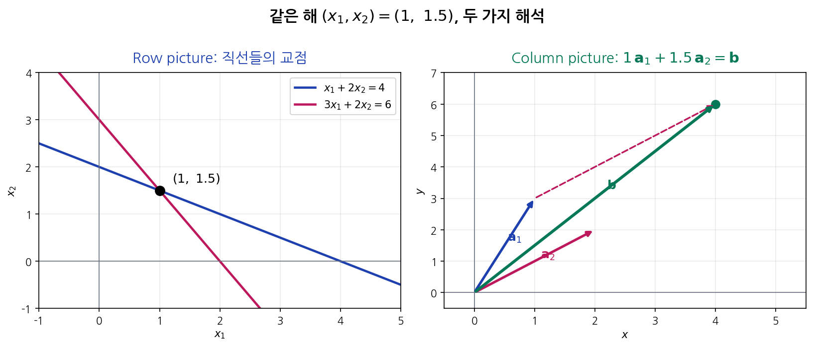
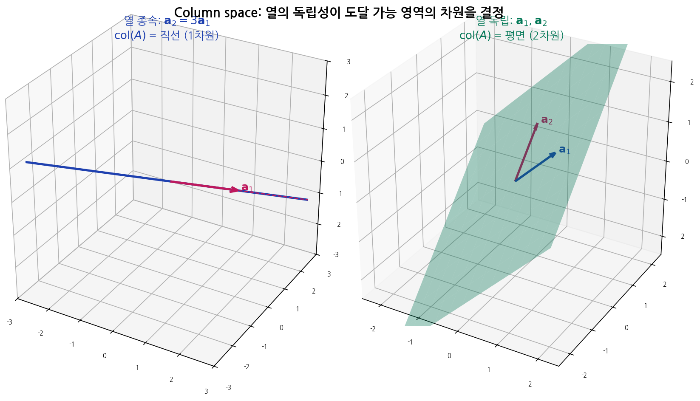
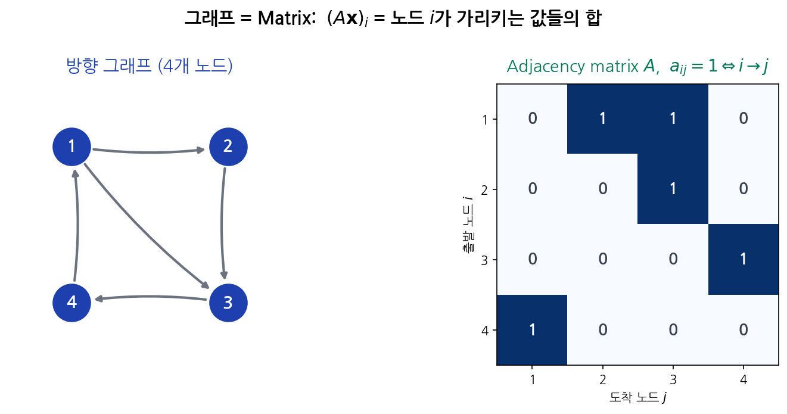

<!-- _class: lead -->
<!-- _paginate: false -->

# Part 1 3회차

## Matrix와 Matrix·Vector 곱의 두 해석

MML §2.2·§2.7 (메인) · Strang Ch 1.3·2.1 (발췌, **Row picture vs Column picture 시그니처**) · [EoLA Ch.3: Linear transformations and matrices](https://www.youtube.com/watch?v=kYB8IZa5AuE) · Part 1 (LA1)

---

<!-- _class: exercise -->

# Review: 2회차 마무리 숙제

지난 회차에서 제기한 문제:

> $\mathbf{u} = (2, 2, 1)^\top$, $\mathbf{v} = (1, -2, 2)^\top$에 대해 Norm(노름) · Inner product(내적) · 코사인 · Cauchy-Schwarz · 항등식을 검증하시오.

### 답

- **(a)** $\|\mathbf{u}\|_2 = \sqrt{4+4+1} = 3$, $\;\|\mathbf{v}\|_2 = \sqrt{1+4+4} = 3$
- **(b)** $\mathbf{u}^\top\mathbf{v} = 2 - 4 + 2 = 0$, 즉 Orthogonal(직교)이다.
- **(c)** $\cos\theta = 0/(3\cdot 3) = 0$ → 정확히 **90°**
- **(d)** $|0| \le 9$ ✓
- **(e)** $\mathbf{u} - \mathbf{v} = (1, 4, -1)^\top$, $\|\cdot\|_2^2 = 18$. 우변 $= 9 + 9 - 0 = 18$ ✓

### 핵심 관찰

$\mathbf{u}^\top \mathbf{v} = 0$일 때 (e) 항등식이 **피타고라스 정리** $\|\mathbf{u} - \mathbf{v}\|^2 = \|\mathbf{u}\|^2 + \|\mathbf{v}\|^2$로 단순화된다.

→ **"Orthogonal"이 LA에서 특별한 위상**을 가지는 출발점이다. 본 회차의 Matrix(행렬) 곱 해석에서 다시 만난다.

---

## 본 회차 핵심 질문

> ### Matrix·Vector(벡터) 곱 $A\mathbf{x}$를 어떻게 해석해야 LA 전체 구조가 보입니까?

이 한 질문이 **Subspace(부분공간) · Dimension(차원) · Rank(랭크) · 해의 존재** 모두를 결정한다.

- 한 가지 정의: $(A\mathbf{x})_i = \sum_j a_{ij} x_j$
- **두 가지 해석**: Row picture(행 방식) vs **Column picture(열 방식)**
- 어느 해석이 "LA의 본 모습"인가? 본 회차의 결론은 **Column picture**

본 회차의 모든 결과는 이 한 식의 두 해석을 따른다.

---

## 학습 목표

이번 회차가 끝나면 학생은 다음을 답할 수 있어야 합니다.

1. **Matrix**의 수학적 정의, 세 가지 발생 동기 (Linear equation(선형방정식) · 변환 · 데이터)
2. **Matrix·Vector 곱**의 두 해석(Row picture vs Column picture)을 정의대로 손계산할 수 있습니다.
3. **Row picture = Inner product의 묶음, Column picture = 열들의 Linear combination** (선형결합)임을 설명할 수 있습니다.
4. **$A\mathbf{x} = \mathbf{b}$의 해 존재** $\iff$ $\mathbf{b} \in \mathrm{col}(A)$임을 진술할 수 있습니다.
5. **Matrix·Matrix 곱**의 4가지 해석을 사용하여 한 곱셈을 4가지로 계산할 수 있습니다.
6. **비가환성** $AB \ne BA$의 예와 의미를 설명할 수 있습니다.

---

## 본 회차 학습 흐름

| 질문 | 답 (이 강의의 답) | 도구 |
|---|---|---|
| 여러 식을 한 객체로? | **Matrix**의 정의 | $A \in \mathbb{R}^{m\times n}$ |
| Matrix를 Vector에 적용하면? | **Matrix·Vector 곱** | $A\mathbf{x}$ |
| 한 식, 두 해석? | **Row picture vs Column picture** | $\sum$ vs Linear combination |
| $A\mathbf{x}=\mathbf{b}$가 풀리는 조건은? | **Column space** (열공간) $\mathrm{col}(A)$ | Column picture 해석 |
| Matrix를 Matrix에 곱하면? | **4가지 해석** | 원소·열·행·outer |
| $AB \ne BA$의 이유는? | **비가환성** | 함수 합성 순서 |

본 회차 학습 흐름의 결론은 **Column picture가 LA의 핵심 구조**라는 점이다.

---

## 수업 흐름

| 순서 | 블록 | 내용 |
|:---:|:---:|---|
| ① | A | **오프닝**: 핵심 질문, 2회차 Review |
| ② | B | **Matrix의 동기와 정의**, 기본 연산 |
| ③ | **C** | **Matrix·Vector 곱의 두 해석** (핵심) |
| ④ | **D** | **$A\mathbf{x}=\mathbf{b}$와 Column space** |
| ⑤ | E | **Matrix·Matrix 곱의 4가지 해석** |
| ⑥ | F | 비가환성·결합·분배, CS·AI 적용 |
| ⑦ | G | **클로징**: 코딩·마무리 문제·숙제 |

> **C·D가 본 회차의 핵심이다.**

---

# B. Matrix: 동기와 정의

## B-1. Matrix가 왜 생겼는가: 세 가지 동기

**(i) Linear equation 묶음**: 미지수가 여러 개인 식들을 한 객체로
$$\begin{cases} 2x_1 + 3x_2 - x_3 = 5 \\ x_1 - x_2 + 4x_3 = 1 \end{cases} \Leftrightarrow \begin{pmatrix} 2 & 3 & -1 \\ 1 & -1 & 4 \end{pmatrix} \mathbf{x} = \mathbf{b}$$

**(ii) Linear transformation(선형변환)의 표현**: $\mathbf{x} \mapsto A\mathbf{x}$, 한 Vector를 다른 Vector로 보내는 **선형 함수**의 표 (Part 2 9회차 본격 정의)

**(iii) 데이터의 묶음**: $n$개 샘플 × $d$개 특징을 한 객체로
- 이미지 100장 × 784픽셀 → $X \in \mathbb{R}^{100 \times 784}$
- 신경망 한 층의 가중치 $W \in \mathbb{R}^{d_\text{out} \times d_\text{in}}$

세 동기 모두 "표 모양의 수의 배열과 곱셈"이 자연스러운 연산이다.

---

## B-2. 형식적 정의

### 정의 2.1 ($m \times n$ Matrix)
$m$행 $n$열의 실수 표입니다.

$$A = \begin{pmatrix} a_{11} & a_{12} & \cdots & a_{1n} \\ a_{21} & a_{22} & \cdots & a_{2n} \\ \vdots & \vdots & \ddots & \vdots \\ a_{m1} & a_{m2} & \cdots & a_{mn} \end{pmatrix} \in \mathbb{R}^{m \times n}$$

표기: $A = (a_{ij})$, **$i$는 행 인덱스, $j$는 열 인덱스**. 행과 열의 혼동은 LA 초보가 흔히 범하는 실수이다.

### 정의 2.2 (열 표현)
$A$의 $j$번째 열을 $\mathbf{a}_j \in \mathbb{R}^m$이라 쓰면
$$A = [\mathbf{a}_1 \mid \mathbf{a}_2 \mid \cdots \mid \mathbf{a}_n]$$

→ **본 회차의 결정적 표기**이다. Column picture 해석에서 매번 사용한다.

**직관 (Matrix의 의미)**: $m \times n$ Matrix $A$는 $n$차원 입력 Vector를 $m$차원 출력 Vector로 보내는 **선형 대응 표**이다. 성분 $a_{ij}$는 "$j$번째 입력 성분이 $i$번째 출력 성분에 기여하는 계수"이다. 한 Matrix 한 개가 $\mathbb{R}^n \to \mathbb{R}^m$의 한 선형사상 전체를 기술한다.

---

## B-3. 기본 연산

### 덧셈·Scalar(스칼라)곱 (성분별)
$$(A + B)_{ij} = a_{ij} + b_{ij}, \qquad (\alpha A)_{ij} = \alpha\,a_{ij}$$

→ $\mathbb{R}^{m \times n}$도 **Vector space 8 axioms** (공리)를 만족한다 (6회차에서 정식 정의되는 Vector space의 추상화).

### Transpose(전치)
$A \in \mathbb{R}^{m \times n}$의 Transpose $A^\top \in \mathbb{R}^{n \times m}$:
$$(A^\top)_{ij} = a_{ji}$$
**행과 열을 뒤집는다**. 즉 $A^\top$의 $i$행 = $A$의 $i$열.

### Symmetric matrix(대칭행렬)
$A^\top = A$인 정사각 Matrix이다. 즉 $a_{ij} = a_{ji}$ (Part 2 5-6회차 Eigenvalue·Spectral theorem의 핵심).

---

<!-- _class: exercise -->

# 잠깐 풀어보기: Matrix 기본

### 문제 1 (계산)
$A = \begin{pmatrix} 1 & 2 \\ 3 & 4 \\ 5 & 6 \end{pmatrix}$의 차원·Transpose·각 열 $\mathbf{a}_1, \mathbf{a}_2$를 적으시오.

### 문제 2 (개념)
다음 Matrix 중 **Symmetric**인 것은 무엇인가?

- (i) $\begin{pmatrix} 1 & 2 \\ 2 & 3 \end{pmatrix}$
- (ii) $\begin{pmatrix} 1 & 2 \\ 3 & 1 \end{pmatrix}$
- (iii) $\begin{pmatrix} 0 & 1 & 2 \\ 1 & 0 & 3 \\ 2 & 3 & 0 \end{pmatrix}$

> **힌트**: $A^\top = A$, 즉 대각선 기준 대칭이면 된다.

---

<!-- _class: exercise -->

## 잠깐 풀어보기: 답

### 문제 1
- 차원: $3 \times 2$ (3행 2열)
- Transpose: $A^\top = \begin{pmatrix} 1 & 3 & 5 \\ 2 & 4 & 6 \end{pmatrix} \in \mathbb{R}^{2 \times 3}$
- 열: $\mathbf{a}_1 = (1, 3, 5)^\top$, $\mathbf{a}_2 = (2, 4, 6)^\top$

### 문제 2
- **(i) ✓ Symmetric**: $a_{12} = a_{21} = 2$
- **(ii) ✗**: $a_{12} = 2 \ne 3 = a_{21}$
- **(iii) ✓ Symmetric**: 모든 $a_{ij} = a_{ji}$

> **메시지**: Symmetric은 정사각 Matrix에서만 정의된다. 비정사각은 Symmetric일 수 없다.

---

# C. 핵심: Matrix·Vector 곱의 두 해석

> 본 회차의 핵심이다. 한 정의 = 두 해석.

## C-1. 정의 (한 식)

### 정의 2.3 (Matrix·Vector 곱)
$A \in \mathbb{R}^{m \times n}$, $\mathbf{x} \in \mathbb{R}^n$에 대해 $A\mathbf{x} \in \mathbb{R}^m$의 $i$성분:

$$(A\mathbf{x})_i = \sum_{j=1}^n a_{ij}\,x_j$$

**조건**: $A$의 **열 수** = $\mathbf{x}$의 차원. 안 맞으면 곱이 정의되지 않는다.

이 한 식을 **두 가지로 묶어 본다**. 그것이 두 해석이다.

---

## C-2. 해석 1: Row picture

> **Strang Ch 1.3·2.1 발췌 (시그니처 1)**: Strang은 $A\mathbf{x} = \mathbf{b}$를 **Row picture**로 본다. 각 행 $\mathbf{r}_i^\top \mathbf{x} = b_i$가 한 초평면 (hyperplane)이고, 해는 모든 초평면의 **교집합**이다. 2D에서는 두 직선의 교점, 3D에서는 세 평면의 교점이다. 본 정의 2.4가 이 발췌의 직접 형식화이다.

### 정의 2.4 (Row picture 해석)
$A$의 $i$행을 $\mathbf{r}_i^\top \in \mathbb{R}^{1 \times n}$이라 하면

$$A\mathbf{x} = \begin{pmatrix} \mathbf{r}_1^\top \mathbf{x} \\ \mathbf{r}_2^\top \mathbf{x} \\ \vdots \\ \mathbf{r}_m^\top \mathbf{x} \end{pmatrix} \;=\; \begin{pmatrix} \mathbf{r}_1 \cdot \mathbf{x} \\ \mathbf{r}_2 \cdot \mathbf{x} \\ \vdots \\ \mathbf{r}_m \cdot \mathbf{x} \end{pmatrix}$$

**$A\mathbf{x}$의 $i$성분 = $A$의 $i$행과 $\mathbf{x}$의 Inner product**이다.

**직관 (Row picture의 의미)**: $A\mathbf{x}$의 $i$번째 출력 성분은 $A$의 $i$행 $\mathbf{r}_i$와 입력 $\mathbf{x}$의 Inner product 한 개이다. 즉 한 출력 성분 = 입력 전체와 한 행의 가중합. $A\mathbf{x} = \mathbf{b}$를 한 줄씩 보면 각 줄이 $\mathbf{r}_i \cdot \mathbf{x} = b_i$라는 한 초평면 (hyperplane) 의 방정식이고, 해는 $m$개 초평면의 교집합이다.

---

## C-3. 해석 2: Column picture [핵심]

> **Strang Ch 1.3·2.1 발췌 (시그니처 2, Strang의 주제곡)**: Strang은 **Column picture가 LA의 핵심 구조**임을 책 전반에서 반복한다. $A\mathbf{x} = \mathbf{b}$ = "$\mathbf{b}$를 $A$의 열들의 Linear combination으로 쓸 수 있는가". 이 한 발췌가 본 회차 D 섹션 (Column space)·7회차 4 fundamental subspaces·8회차 차원정리까지의 출발점이다.

### 정의 2.5 (Column picture 해석)
$A$의 $j$열을 $\mathbf{a}_j \in \mathbb{R}^m$이라 하면

$$A\mathbf{x} = x_1 \mathbf{a}_1 + x_2 \mathbf{a}_2 + \cdots + x_n \mathbf{a}_n$$

**$A\mathbf{x}$ = $A$의 열들의 Linear combination**이다 (계수가 $\mathbf{x}$의 성분).

→ **1회차 Linear combination과 동일한 식**이다. $A\mathbf{x}$는 **$\mathbf{x}$로 만든 레시피로 $A$의 열들을 섞은 결과**이다.

**직관 (Column picture의 의미)**: $A\mathbf{x} = x_1 \mathbf{a}_1 + \cdots + x_n \mathbf{a}_n$은 $A$의 열들의 Linear combination이다. 즉 $A\mathbf{x}$로 도달 가능한 모든 결과의 집합은 $A$의 열들이 만드는 Span이며, 이를 $A$의 Column space $C(A)$라 부른다. $A\mathbf{x} = \mathbf{b}$의 해가 존재할 필요충분조건이 $\mathbf{b} \in C(A)$이다 (D 섹션·7회차·8회차에서 정식화).

---

## C-4. 두 해석이 같다는 증명

성분별로 계산:

$$(x_1 \mathbf{a}_1 + \cdots + x_n \mathbf{a}_n)_i = x_1 a_{i1} + x_2 a_{i2} + \cdots + x_n a_{in} = \sum_j a_{ij} x_j = (A\mathbf{x})_i$$

**같은 식, 다른 묶음이다.** $\blacksquare$

| 해석 | 묶는 단위 | 결과 |
|---|---|---|
| **Row picture** | 한 행씩 ($\mathbf{r}_i \cdot \mathbf{x}$) | 출력의 $i$성분 |
| **Column picture** | 한 열씩 ($x_j \mathbf{a}_j$) | 출력 Vector 전체 |

→ **두 해석은 같은 결과**이지만 **다른 통찰**을 준다. 다음 슬라이드부터 그 이유를 다룬다.

---

## C-5. Column picture가 LA의 핵심 구조인 이유

- **Row picture**는 "한 출력 성분을 어떻게 계산할 것인가"를 알려준다, **계산 알고리즘**의 관점.
- **Column picture**는 "$A\mathbf{x}$로 도달 가능한 Vector들의 집합은 무엇인가"를 알려준다, **구조**의 관점.

$\{A\mathbf{x} : \mathbf{x} \in \mathbb{R}^n\}$ = $A$의 열들의 **모든 Linear combination** = $\mathrm{span}(\mathbf{a}_1, \ldots, \mathbf{a}_n)$.

이것을 **$A$의 Column space** $\mathrm{col}(A)$라 부른다 (7회차 정식 정의).

> **결론**: Row picture는 **계산**, Column picture는 **구조**이다. LA의 핵심 구조 (Subspace · Rank · 해 존재)는 **Column picture에서 시작**된다.

---

## C-6. 한 장으로 보는 두 해석

$\begin{cases} x_1 + 2x_2 = 4 \\ 3x_1 + 2x_2 = 6 \end{cases}$, 해 $(x_1, x_2) = (1,\ 1.5)$

**Row picture**는 두 직선의 교점, **Column picture**는 두 열 $\mathbf{a}_1, \mathbf{a}_2$를 $1, 1.5$배 섞어 $\mathbf{b}$에 도달하는 그림이다. 같은 해를 다른 통찰로 본다.

---

<!-- _class: exercise -->

# 잠깐 풀어보기: 두 해석

$A = \begin{pmatrix} 1 & 2 \\ 3 & 4 \\ 5 & 6 \end{pmatrix}$, $\mathbf{x} = \begin{pmatrix} 2 \\ -1 \end{pmatrix}$

### 문제 1 (Row picture)
각 행과 $\mathbf{x}$의 Inner product로 $A\mathbf{x}$를 구하시오.

### 문제 2 (Column picture)
$A$의 두 열의 Linear combination으로 $A\mathbf{x}$를 구하시오.

### 문제 3 (사고)
두 결과가 같다는 사실에서 어떤 **구조적** 사실을 알 수 있는가? ($A$의 열들이 $\mathbb{R}^3$의 어떤 부분집합을 만드는가)

---

<!-- _class: exercise -->

## 잠깐 풀어보기: 답

### 문제 1 (Row picture)
- 1행: $(1, 2) \cdot (2, -1) = 2 - 2 = 0$
- 2행: $(3, 4) \cdot (2, -1) = 6 - 4 = 2$
- 3행: $(5, 6) \cdot (2, -1) = 10 - 6 = 4$
- $\therefore A\mathbf{x} = (0, 2, 4)^\top$

### 문제 2 (Column picture)
$A\mathbf{x} = 2\cdot(1, 3, 5)^\top + (-1)\cdot(2, 4, 6)^\top = (2-2,\,6-4,\,10-6)^\top = (0, 2, 4)^\top$ ✓ 같음

### 문제 3 (사고)
$A$의 두 열은 $\mathbb{R}^3$의 **평면**을 만든다 ($(1,3,5)^\top$와 $(2,4,6)^\top$이 Linear independence(일차독립)이므로). 어떤 $\mathbf{x}$를 잡아도 $A\mathbf{x}$는 **그 평면 안에만** 들어간다.

> **메시지**: $A\mathbf{x}$의 도달 가능 집합 = **열들이 만드는 Subspace**이다. 이것이 7·8회차의 출발점이다.

---

# D. $A\mathbf{x} = \mathbf{b}$와 Column space

> 1회차에서 본 "Vector로 데이터를 표현"이 이제 "방정식 풀이"로 발전한다.

## D-1. $A\mathbf{x} = \mathbf{b}$의 의미 (Column picture 재해석)

$A\mathbf{x} = \mathbf{b}$를 푼다:

**(Column picture)** $\mathbf{b}$를 **$A$의 열들의 Linear combination으로 쓸 수 있는가**?

$$x_1 \mathbf{a}_1 + x_2 \mathbf{a}_2 + \cdots + x_n \mathbf{a}_n = \mathbf{b}$$

이것이 가능한가? 가능하면 $\mathbf{x}$가 그 계수이다. 불가능하면 해가 없다.

### 즉시 따라오는 결론

- $A\mathbf{x} = \mathbf{b}$ **해 존재** $\iff$ $\mathbf{b} \in \mathrm{span}(\mathbf{a}_1, \ldots, \mathbf{a}_n) = \mathrm{col}(A)$
- $\mathbf{b}$가 Column space **밖에 있으면** 어떻게 잡아도 해가 없다.

---

## D-2. 예시: 해의 존재가 갈리는 두 경우

$A = \begin{pmatrix} 1 & 2 \\ 2 & 4 \end{pmatrix}$ (두 열이 평행, $\mathbf{a}_2 = 2\mathbf{a}_1$).

**Column space**: $\mathrm{col}(A) = \{t \cdot (1,2)^\top : t \in \mathbb{R}\}$ — $\mathbb{R}^2$의 **직선**.

| $\mathbf{b}$ | 직선 위? | 해 |
|---|:---:|---|
| $(3, 6)^\top$ | ✓ ($t=3$) | 무수히 많은 해 ($x_1 + 2x_2 = 3$의 모든 점) |
| $(1, 3)^\top$ | ✗ | 해 없음 |

→ **$A$가 같아도 $\mathbf{b}$의 위치에 따라 해 존재 여부가 결정**된다. 그 위치는 **$A$의 Column space**로 결정된다.

---

## D-2b. Column space의 모양: 직선과 평면

열들이 **종속**이면 $\mathrm{col}(A)$는 더 낮은 차원으로 무너진다 (왼쪽: 직선). 열들이 **독립**이면 온전한 차원을 채운다 (오른쪽: 평면). $A\mathbf{x} = \mathbf{b}$의 해는 $\mathbf{b}$가 이 영역 **안에 있을 때만** 존재한다.

---

## D-3. 해의 유일성과 Linear independence (예고)

해가 **존재**하면 **유일한가? 무수히 많은가?**

답: $A$의 **열들이 Linear independence인가**에 달려 있다.

- Linear independence → 유일한 표현 → 유일한 해
- Linear dependence → 무수히 많은 표현 → 무수히 많은 해 (해가 있는 경우)

→ **8회차에서 정식 정의·증명한다.** 본 회차에서는 직관까지 다룬다.

| $A$의 열 | 해 존재 (b가 col 안) | 해 유일성 |
|---|---|---|
| Linear independence | 있으면 유일 | ✓ 유일 |
| Linear dependence | 있으면 무수 | ✗ 무수 |

---

<!-- _class: exercise -->

# 잠깐 풀어보기: Column space와 해

### 문제 1 (Column space)
$A = \begin{pmatrix} 1 & 3 \\ 2 & 6 \\ -1 & -3 \end{pmatrix}$의 Column space $\mathrm{col}(A)$는 $\mathbb{R}^3$의 어떤 모양인가?

### 문제 2 (해의 존재)
위 $A$에 대해 $\mathbf{b} = (2, 4, -2)^\top$가 $\mathrm{col}(A)$ 안에 있는가? 있다면 $A\mathbf{x} = \mathbf{b}$의 해 하나를 구하시오.

### 문제 3 (해 없음)
같은 $A$에 대해 $\mathbf{b} = (1, 1, 1)^\top$일 때는 어떠한가?

---

<!-- _class: exercise -->

## 잠깐 풀어보기: 답

### 문제 1
$\mathbf{a}_2 = (3, 6, -3)^\top = 3 \cdot \mathbf{a}_1$, 두 열이 평행하다.
$\mathrm{col}(A) = \{t \cdot (1, 2, -1)^\top : t \in \mathbb{R}\}$, **1차원 직선**.

### 문제 2
$\mathbf{b} = (2, 4, -2)^\top = 2 \cdot (1, 2, -1)^\top$, 직선 위 ✓
해: $x_1 \cdot (1,2,-1)^\top + x_2 \cdot (3,6,-3)^\top = (2,4,-2)^\top$. 예: $(x_1, x_2) = (2, 0)$ 또는 $(-1, 1)$ 등 **무수히 많다**.

### 문제 3
$\mathbf{b} = (1,1,1)^\top$, 직선 위 ✗ (둘째 성분이 첫 성분의 2배여야 하는데 둘 다 1). **해 없음**.

> **메시지**: $A$의 행 수가 3이라고 $\mathbf{b}$가 $\mathbb{R}^3$ 어디든 갈 수 있는 것은 아니다. **Column space의 차원이 실제 도달 가능 영역**이다.

---

# E. Matrix·Matrix 곱: 4가지 해석

> $C = AB$를 한 식이 아닌 4가지로 본다. 같은 결과, 다른 통찰.

## E-1. 정의

### 정의 2.6 (Matrix·Matrix 곱)
$A \in \mathbb{R}^{m \times k}$, $B \in \mathbb{R}^{k \times n}$일 때 $C = AB \in \mathbb{R}^{m \times n}$:

$$c_{ij} = \sum_{l=1}^k a_{il}\,b_{lj}$$

**조건**: $A$의 **열 수** = $B$의 **행 수** ($= k$, "inner dimension"). 안 맞으면 곱이 정의되지 않는다.

결과 차원: $m \times n$ (outer dimensions).

이 한 식을 **4가지로 묶어 본다**.

---

## E-2. 해석 1·2: 원소 = Inner product, 열 묶음

### 해석 1: 원소

$$c_{ij} = (A\text{의 } i\text{행}) \cdot (B\text{의 } j\text{열})$$

가장 흔히 배우는 정의 (손계산 표준). **예시**: $\begin{pmatrix} 1 & 2 \\ 3 & 4 \end{pmatrix} \begin{pmatrix} 5 & 6 \\ 7 & 8 \end{pmatrix}$의 (1,1) 원소 = $(1,2)\cdot(5,7) = 19$.

### 해석 2: 열 묶음

$AB$의 $j$열 = $A \cdot (B$의 $j$열$)$

$$AB = A [\mathbf{b}_1 \mid \cdots \mid \mathbf{b}_n] = [A\mathbf{b}_1 \mid \cdots \mid A\mathbf{b}_n]$$

**Matrix·Vector 곱을 $n$번 반복**한 것이며, 각 열이 $A$의 열들의 Linear combination이다. 이 해석으로 **$AB$의 Column space ⊆ $A$의 Column space**가 즉시 따라온다.

---

## E-3. 해석 3: 행 묶음

$AB$의 $i$행 = $(A$의 $i$행$) \cdot B$

$$AB = \begin{pmatrix} \mathbf{r}_1^\top B \\ \mathbf{r}_2^\top B \\ \vdots \\ \mathbf{r}_m^\top B \end{pmatrix}$$

각 행이 $B$의 행들의 Linear combination이다. **$AB$의 행공간 ⊆ $B$의 행공간**.

---

## E-4. 해석 4: Outer product(외적)의 합

$A$의 $l$번째 열 $\mathbf{a}_l$과 $B$의 $l$번째 행 $\mathbf{b}_l^\top$의 **Outer product**를 모두 더한다:

$$AB = \sum_{l=1}^k \mathbf{a}_l \mathbf{b}_l^\top$$

각 항 $\mathbf{a}_l \mathbf{b}_l^\top$은 **rank-1 Matrix** ($m \times n$)이다. 합이 $AB$이다.

**직관 (Outer product의 의미)**: $\mathbf{u} \in \mathbb{R}^m$, $\mathbf{v} \in \mathbb{R}^n$의 Outer product $\mathbf{u}\mathbf{v}^\top \in \mathbb{R}^{m \times n}$는 성분 $(i, j)$가 $u_i v_j$인 rank-1 Matrix이다. 모든 행이 $\mathbf{v}^\top$의 Scalar배, 모든 열이 $\mathbf{u}$의 Scalar배이므로 단 하나의 독립적 방향만 가진다. 임의 Matrix $AB$를 이런 rank-1 Matrix $k$개의 합으로 분해할 수 있다 ($k = A$의 열 수). 본 분해 표현이 Part 2 8-9회차 SVD의 핵심 표현이다.

---

## E-5. 4가지 해석: 한 표

| 해석 | 식 | 통찰 |
|:---:|---|---|
| (1) 원소 | $c_{ij} = \mathbf{r}_i^A \cdot \mathbf{c}_j^B$ | 손계산 |
| (2) 열 | $AB = [A\mathbf{b}_1 \mid \cdots]$ | $AB$ 열 ⊂ $A$ Column space |
| (3) 행 | $i\text{행 of } AB = \mathbf{r}_i^A B$ | $AB$ 행 ⊂ $B$ 행공간 |
| (4) outer | $AB = \sum \mathbf{a}_l \mathbf{b}_l^\top$ | Low-rank 분해 (SVD) |

**같은 결과, 4가지 사고 도구**이다. 문제에 따라 골라 쓴다.

---

<!-- _class: exercise -->

# 잠깐 풀어보기: Matrix 곱 4가지 해석

$A = \begin{pmatrix} 1 & 2 \\ 3 & 4 \end{pmatrix}$, $B = \begin{pmatrix} 5 & 6 \\ 7 & 8 \end{pmatrix}$

### 문제 1 (원소 해석)
$AB$의 4개 원소를 Inner product로 구하시오.

### 문제 2 (열 해석)
$AB$의 두 열을 $A \cdot$(B의 각 열)로 구하시오. 문제 1과 일치하는가?

### 문제 3 (Outer 해석)
$AB$를 두 Outer product의 합 $\mathbf{a}_1 \mathbf{b}_1^\top + \mathbf{a}_2 \mathbf{b}_2^\top$으로 구하시오. (단 $\mathbf{a}_l$ = $A$의 $l$번째 열, $\mathbf{b}_l$ = $B$의 $l$번째 행을 열Vector로)

---

<!-- _class: exercise -->

## 잠깐 풀어보기: 답

### 문제 1 (원소)
$(AB)_{11} = (1,2)\cdot(5,7) = 19$, $(AB)_{12} = (1,2)\cdot(6,8) = 22$,
$(AB)_{21} = (3,4)\cdot(5,7) = 43$, $(AB)_{22} = (3,4)\cdot(6,8) = 50$

$AB = \begin{pmatrix} 19 & 22 \\ 43 & 50 \end{pmatrix}$

### 문제 2 (열)
$A\mathbf{b}_1 = A(5,7)^\top = 5(1,3)^\top + 7(2,4)^\top = (19, 43)^\top$ ✓
$A\mathbf{b}_2 = A(6,8)^\top = 6(1,3)^\top + 8(2,4)^\top = (22, 50)^\top$ ✓

### 문제 3 (Outer)
$\mathbf{a}_1\mathbf{b}_1^\top = (1,3)^\top (5,6) = \begin{pmatrix} 5 & 6 \\ 15 & 18 \end{pmatrix}$,
$\mathbf{a}_2\mathbf{b}_2^\top = (2,4)^\top (7,8) = \begin{pmatrix} 14 & 16 \\ 28 & 32 \end{pmatrix}$

합 = $\begin{pmatrix} 19 & 22 \\ 43 & 50 \end{pmatrix}$ ✓ 같음

---

# F. 비가환성·결합·CS·AI 적용

## F-1. 비가환성 $AB \ne BA$

### 예시
$A = \begin{pmatrix} 0 & 1 \\ 0 & 0 \end{pmatrix}$, $B = \begin{pmatrix} 0 & 0 \\ 1 & 0 \end{pmatrix}$:

$AB = \begin{pmatrix} 1 & 0 \\ 0 & 0 \end{pmatrix}$, $BA = \begin{pmatrix} 0 & 0 \\ 0 & 1 \end{pmatrix}$, 완전히 다르다.

### 차원 차이로 한쪽만 가능
$A \in \mathbb{R}^{2 \times 3}$, $B \in \mathbb{R}^{3 \times 4}$: $AB$는 정의되지만 $BA$는 정의되지 않는다.

**직관 (함수 합성으로서의 곱)**: Matrix 곱 $AB$는 선형사상 합성 $A \circ B$이다. 즉 $(AB)\mathbf{x} = A(B\mathbf{x})$, 입력 $\mathbf{x}$에 먼저 $B$를 적용한 뒤 그 결과에 $A$를 적용한다. 함수 합성이 일반적으로 비가환이므로 ($f \circ g \ne g \circ f$) Matrix 곱도 비가환이다.

### 결합·분배는 성립
- $(AB)C = A(BC)$ ✓
- $A(B+C) = AB + AC$ ✓
- $(AB)^\top = B^\top A^\top$ ← **순서가 뒤집힌다**

---

## F-2. CS·AI 적용

### 신경망 한 층
$$\mathbf{y} = W\mathbf{x} + \mathbf{b}, \quad W \in \mathbb{R}^{d_\text{out} \times d_\text{in}}$$

- $W\mathbf{x}$ = **$W$의 열들의 Linear combination** (Column picture), "$d_\text{in}$개 입력 특징을 어떤 비율로 섞을 것인가"
- 또는 **$d_\text{out}$개 뉴런 각각의 가중 합** (Row picture)

### Transformer Attention(어텐션)
$$\text{Attn}(Q, K, V) = \mathrm{softmax}\!\left(\frac{QK^\top}{\sqrt{d_k}}\right) V$$

- $QK^\top$, **모든 query·key 쌍의 Inner product** (1·2회차, 본 회차 Row picture)
- $\cdots V$, **$V$의 행들의 가중합** (본 회차 Row picture)
- softmax 가중치는 **각 query가 어느 key에 얼마나 주목하는가**를 결정한다.

본 회차에서 본 두 해석이 Transformer의 모든 Matrix 곱을 설명한다.

---

## F-2b. 그래프 = Matrix: Adjacency matrix

노드 $i \to j$ 간선이 있으면 $a_{ij} = 1$인 Matrix가 **Adjacency matrix**(인접행렬)이다.

- $A\mathbf{x}$의 $i$성분 (Row picture) = 노드 $i$가 가리키는 노드들의 합
- $A^2$의 $(i, j)$ = $i \to j$ 길이 2 경로의 수 (Matrix 곱의 의미)
- Graph Neural Network(그래프 신경망)는 $A$를 반복 곱해 이웃 정보를 모은다.

---

## F-3. GPU에서 빠른 이유

| 해석 | 병렬화 효율 |
|---|---|
| 원소 = Inner product | 모든 $c_{ij}$를 독립 스레드로 (병렬화 최고) |
| 열 묶음 | $n$개 열을 독립 스레드로 |
| Outer 합 | 각 항 $\mathbf{a}_l \mathbf{b}_l^\top$를 GPU 코어에 분산 |

→ **Matrix 곱은 GPU의 천직**이다. 같은 연산을 수많은 코어가 독립적으로 처리한다.

cuBLAS·oneDNN 같은 라이브러리는 위 해석들을 Matrix 크기·메모리 패턴에 따라 **자동 전환**한다.

---

# G. 클로징

## G-1. 코딩 실습 골자

→ [Colab으로 실행](https://colab.research.google.com/github/repairer5812/linear-algebra-for-ai/blob/main/notebooks/Part1/03_%ED%96%89%EB%A0%AC_%ED%96%89%EB%A0%AC%EB%B2%A1%ED%84%B0%EA%B3%B1.ipynb)

1. NumPy에서 `@` 연산자로 Matrix 곱
2. **Row picture · Column picture 직접 구현**: `for i: dot(A[i], x)` vs `sum(x[j] * A[:, j] for j)`
3. 두 결과가 `np.allclose`로 같음을 확인
4. **속도 비교**: 손구현 vs NumPy `@` (broadcasting의 위력)
5. MNIST 데이터셋에 가중치 Matrix $W$를 곱해 "한 층 통과"
6. 4가지 해석으로 같은 곱을 계산하여 통찰의 차이를 체험한다.

---

## G-2. 본 회차 핵심 5개

1. **Matrix** = 표 모양의 수의 배열, Linear transformation의 표현
2. **Matrix·Vector 곱의 두 해석**: Row picture (Inner product 묶음) / **Column picture (Linear combination)**
3. **Column picture가 LA의 핵심 구조**이다. Column space · Rank · 해 존재가 모두 여기서 따라온다.
4. **$A\mathbf{x}=\mathbf{b}$의 해 존재** $\iff$ **$\mathbf{b} \in \mathrm{col}(A)$**
5. **Matrix·Matrix 곱의 4가지 해석**: 원소·열·행·Outer. 같은 결과, 다른 통찰.

---

## G-3. 자기 점검 질문

- $A \in \mathbb{R}^{4 \times 3}$, $\mathbf{x} \in \mathbb{R}^3$. $A\mathbf{x}$의 차원은? Column picture로 풀면 몇 개 열의 Linear combination인가?
- $A \in \mathbb{R}^{3 \times 5}$. $A\mathbf{x} = \mathbf{b}$가 모든 $\mathbf{b} \in \mathbb{R}^3$에 대해 해를 가지려면 $\mathrm{col}(A)$가 어떤 조건을 만족해야 하는가?
- $A, B \in \mathbb{R}^{2 \times 2}$. $(AB)^\top$를 $A^\top, B^\top$로 표현하시오.
- Outer product $\mathbf{u}\mathbf{v}^\top$의 Rank는 얼마인가?

---

<!-- _class: exercise -->

# 본 회차 마무리 문제 (즉석 풀이)

본 회차 학습 흐름 (Matrix → 두 해석 → Column space → Matrix 곱)을 **한 문제**로 종합한다.

$A = \begin{pmatrix} 1 & 2 \\ 2 & 4 \\ 3 & 6 \end{pmatrix}$, $\mathbf{x} = \begin{pmatrix} 3 \\ -1 \end{pmatrix}$, $\mathbf{b}_1 = \begin{pmatrix} 1 \\ 2 \\ 3 \end{pmatrix}$, $\mathbf{b}_2 = \begin{pmatrix} 1 \\ 1 \\ 1 \end{pmatrix}$

- **(a)** $A\mathbf{x}$를 **Row picture**로 구하시오.
- **(b)** 같은 $A\mathbf{x}$를 **Column picture**로 구하시오.
- **(c)** $A$의 두 열의 관계는 무엇인가? $\mathrm{col}(A)$는 $\mathbb{R}^3$의 어떤 모양인가?
- **(d)** $A\mathbf{x} = \mathbf{b}_1$의 해가 존재하는가? $A\mathbf{x} = \mathbf{b}_2$는 어떠한가?

---

<!-- _class: exercise -->

## 본 회차 마무리 문제: 답

- **(a)** Row: $(1,2)\cdot(3,-1) = 1$, $(2,4)\cdot(3,-1) = 2$, $(3,6)\cdot(3,-1) = 3$ → $A\mathbf{x} = (1, 2, 3)^\top$
- **(b)** Column: $3\cdot(1,2,3)^\top + (-1)\cdot(2,4,6)^\top = (1, 2, 3)^\top$ ✓
- **(c)** $\mathbf{a}_2 = 2\mathbf{a}_1$, 두 열이 평행하다. $\mathrm{col}(A) = \{t \cdot (1,2,3)^\top : t \in \mathbb{R}\}$, **1차원 직선**.
- **(d)** $\mathbf{b}_1 = (1,2,3)^\top$, 직선 위 ($t = 1$) → 해 있음 (무수히, Linear dependence). $\mathbf{b}_2 = (1,1,1)^\top$, 직선 위 아님 → **해 없음**.

> **핵심**: $A$의 행이 3이라고 도달 가능한 영역이 $\mathbb{R}^3$ 전체가 아니다. **Column space가 실제 도달 영역**이고, 이것이 7-8회차의 출발점이다.

---

<!-- _class: exercise -->

## 다음 회차 Review용 숙제

위 마무리 문제의 **유사 문제**이다. 4회차 Review 시간에 함께 답을 맞춘다.

$A = \begin{pmatrix} 1 & 0 & 1 \\ 0 & 1 & 1 \\ 1 & 1 & 2 \end{pmatrix}$, $\mathbf{x} = (1, 1, 1)^\top$

- (a) $A\mathbf{x}$를 Row picture · Column picture로 각각 구하시오.
- (b) $A$의 세 열 사이에 어떤 관계가 있는가? (셋째 열을 처음 둘로 표현할 수 있는가?)
- (c) $\mathrm{col}(A)$는 $\mathbb{R}^3$의 어떤 모양인가 (직선·평면·전체)?
- (d) $A\mathbf{y} = (1, 2, 3)^\top$의 해 존재 여부를 (c)를 사용해 판정하시오.

### 자기 점검

- 셋째 열을 분해할 수 있다면 그 의미는 무엇인가?
- $\mathbb{R}^3$의 평면을 정의하는 데 Linear independence Vector가 몇 개 필요한가?

4회차 본 주제 (**일반 Linear equation 풀이**)와 직접 연결된다.

---

## G-4. 과제 안내

`04_과제/Part1/03회차_homework.md` — 마감: 4회차 시작 전

**수학 30점**
- Matrix·Vector 곱 두 해석 손계산 (5문제)
- 4가지 Matrix 곱 해석으로 같은 곱 계산 (1문제 × 4해석)
- $A\mathbf{x} = \mathbf{b}$ 해 존재 판정 (3문제)
- $(AB)^\top = B^\top A^\top$ 직접 증명

**코딩 20점**
- 두 해석을 NumPy `for`문으로 구현 후 `@`와 비교
- 속도 측정 ($n = 10, 100, 1000$ × $n = 10, 100, 1000$ Matrix)
- MNIST 한 층 통과 시뮬레이션

---

## G-5. 다음 회차 (4회차) 예고

**주제**: Linear equation 풀이, 가우스 소거법·기약사다리꼴(RREF)

**연결**: 본 회차에서 본 $A\mathbf{x} = \mathbf{b}$의 **해 존재**를 **구체적 알고리즘으로 푸는 방법**입니다. 가우스 소거가 본질적으로 **Row picture의 체계적 운영**이라는 사실, 그리고 그 결과로 나오는 RREF가 Column space와 해의 구조를 직접 드러낸다는 사실을 봅니다.

**사전 reading**:
- **MML §2.3.1-§2.3.3** (Solving Systems of Linear Equations · Elementary Transformations · RREF), 메인
- **Strang Ch 2.1-2.3 발췌** (Elementary matrix · Gaussian elimination 절차, 시그니처), 본문 박스로 가져옴
- 3Blue1Brown EoLA Ch.7 (Inverse matrices, column space, null space)

---

<!-- _class: lead -->

# Q & A

본 회차 학습 흐름:
**Matrix → Matrix·Vector 곱 → 두 해석 → Column space → 해 존재 → Matrix 곱 4해석**

핵심 한 줄: **$A\mathbf{x}$ = $A$의 열들의 Linear combination** (Column picture가 LA의 핵심 구조).

`HANDOUT`: 본 PDF, `03_행렬_행렬벡터곱.ipynb`
